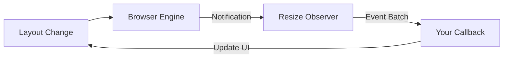

import Tabs from '@theme/Tabs';
import TabItem from '@theme/TabItem';

# Resize Observer Loop Limits

The **Resize Observer API** allows you to be notified when the size of an element's content rectangle, or its border box, changes. Unlike `window.onresize`, which only detects the entire window scaling, this observes individual components.

:::info[Core Philosophy]
**Asynchronous Geometry**. Resize Observer is designed to notify you at the end of the frame's layout cycle. It solves the performance issues of polling `offsetWidth` and provides a reliable way to build components that respond to their own dimensions.
:::

---

## 1. Easy: Basic Consumption

Use this to build a component that changes its layout when its container shrinks.



---

## 2. Medium: The "Loop Limit Exceeded" Error

The browser is smart. If your `ResizeObserver` callback **causes** the element to resize (e.g., you change its padding in response to its width), it might trigger another resize event. This creates an infinite loop.

To prevent the browser from hanging, the engine detects this and throws the error: `ResizeObserver loop limit exceeded`. 

---

## 3. Hard: Implementation and Safety

<Tabs groupId="lang" queryString>
<TabItem value="js" label="JavaScript">

```javascript
// High-performance resize tracking
const ro = new ResizeObserver((entries, observer) => {
  for (const entry of entries) {
    // entry.contentRect gives you dimensions without padding/border
    const { width, height } = entry.contentRect;
    
    // AVOID: Modifying the styles of 'entry.target' directly here
    // as it might trigger a recursive loop.
    console.log(`Element size: ${width}x${height}`);
  }
});

ro.observe(document.querySelector('.responsive-card'));
```

</TabItem>
<TabItem value="ts" label="TypeScript">

```typescript
// Tracking multiple box models
const handleResize: ResizeObserverCallback = (entries) => {
  entries.forEach((entry) => {
    // borderBoxSize is available for more precise measurements
    const borderBox = entry.borderBoxSize[0];
    console.log("Inline Size (Width):", borderBox.inlineSize);
  });
};

const observer = new ResizeObserver(handleResize);
```

</TabItem>
</Tabs>

---

## 4. Advanced: The "Depth" and Render Cycle

How does the browser decide which notifications to deliver?
1. The browser checks elements from **top to bottom** of the DOM tree.
2. If an element at Depth 5 triggers a resize of an element at Depth 6, the notification for Depth 6 is added to the queue for the **current** frame.
3. If Depth 6 triggers Depth 2 (going "up" the tree), the notification for Depth 2 is delayed until the **next** frame. 
4. This mechanism ensures that the browser eventually reaches a "stable state."

---

## 5. Interview Prep: 4 Key Questions

### Q1: Why is Resize Observer better than a "resize" event listener?
**A:** The `window.onresize` event only fires when the entire browser window is resized. It does not detect when an element changes size due to layout shifts (like a sidebar opening or dynamic content injection). **Resize Observer** tracks individual elements, and its callback is delivered *after* the browser's initial layout but *before* the paint, making it more efficient and accurate.

### Q2: What causes the "ResizeObserver loop limit exceeded" error?
**A:** This occurs when a ResizeObserver's callback triggers a layout change that results in **new** resize notifications in the same frame. For example: a component shrinks, its callback reduces its font size, which shrinking the component further. The browser stops the loop to prevent the UI from freezing.

### Q3: How do you handle the loop limit error effectively?
**A:** In most cases, these errors are non-fatal warnings that you can ignore, as the browser will simply deliver the remaining notifications in the next frame. However, to eliminate them, you should ensure that your resizing logic strictly "converges"—meaning it eventually stops changing the element's size—or offload style changes to a `requestAnimationFrame`.

### Q4: Explain the difference between `contentRect` and `borderBoxSize`.
**A:** `contentRect` is the legacy way of reporting size; it represents the dimensions of the content area only. `borderBoxSize` is the modern approach; it returns an array of size objects (to support multi-fragment elements like columns) and represents the size including padding and borders, which is usually more relevant for layout logic.
