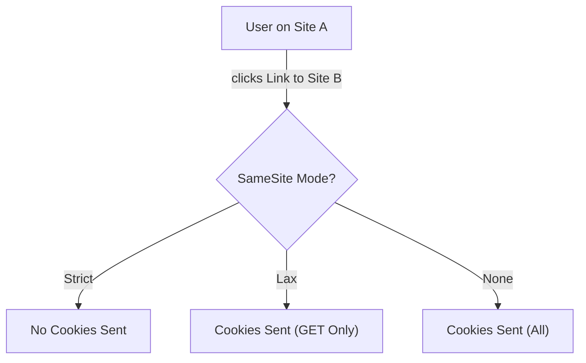

import Tabs from '@theme/Tabs';
import TabItem from '@theme/TabItem';

# SameSite Cookie Modes

The **SameSite** attribute of the `Set-Cookie` HTTP header allows servers to declare whether a cookie should be sent with cross-site requests. This is the browser's primary defense against **CSRF** (Cross-Site Request Forgery) attacks.

:::info[Core Philosophy]
**Contextual Identity**. Not every request to a server should include the user's session cookie. SameSite ensures that cookies are only sent when the user's "intent" is clear (e.g., they are actually on your site).
:::

---

## 1. Easy: The Three Modes

1.  **Strict**: Cookies are **never** sent on cross-site requests. If you click a link from Facebook to your Bank, you will appear logged out until you refresh or navigate internally.
2.  **Lax**: Cookies are not sent on "dangerous" cross-site requests (like POST), but **are** sent when a user clicks a top-level link. This is the modern browser default.
3.  **None**: Cookies are sent on all requests (requires the `Secure` flag). This is used for third-party widgets and tracking.



---

## 2. Medium: The "Lax by Default" Shift

In 2020, major browsers (Chrome, Firefox, Edge) changed the default behavior. If a cookie does not specify a SameSite attribute, the browser now treats it as `SameSite=Lax`. 
-   **Why?** To provide "out of the box" protection against CSRF for legacy applications.
-   **The Catch**: If your application relies on `POST` requests from third-party sites (like an OAuth callback or a payment notification), those requests will now fail unless you explicitly set `SameSite=None; Secure`.

---

## 3. Hard: Implementation and CHIPS

<Tabs groupId="lang" queryString>
<TabItem value="js" label="JavaScript">

```javascript
// Setting secure, modern cookies in Node/Express
res.cookie('sessionId', '12345', {
  httpOnly: true,
  secure: true, // Required for SameSite=None
  sameSite: 'Lax', // Best balance of UX and Security
  maxAge: 3600000 // 1 hour
});
```

</TabItem>
<TabItem value="ts" label="TypeScript">

```typescript
// Implementing Partitioned Cookies (CHIPS)
// CHIPS allows a third-party cookie to be 'partitioned' 
// so it is only sent when the user is on a specific site.
const setPartitionedCookie = (res: any) => {
  // 'Partitioned' is a new attribute to replace 3rd party cookies
  res.setHeader(
    'Set-Cookie', 
    'widget_pref=dark; SameSite=None; Secure; Partitioned'
  );
};
```

</TabItem>
</Tabs>

---

## 4. Advanced: CSRF and the "2 Minute" Rule

Chrome implemented a "Lax + POST" intervention. For the first **2 minutes** after a cookie is created (without an explicit SameSite attribute), it will actually be sent on cross-site `POST` requests. 
1.  **Reason**: To allow top-level "Sign In" flows to complete immediately after the user logs in.
2.  **The Danger**: This creates a small window of vulnerability. To be truly secure, you must **always** specify a SameSite mode and not rely on the browser's 2-minute grace period.

---

## 5. Interview Prep: 4 Key Questions

### Q1: What is the difference between `Strict` and `Lax`?
**A:** `Strict` is the most secure but has poor UX; cookies are never sent if the request originates from a different domain, meaning even a simple link click will result in the user appearing logged out. `Lax` is the balanced default; it blocks cookies on "unsafe" methods (like `POST` or `PUT`) but allows them on "safe" top-level navigations (like `<a href="...">`), maintaining a seamless login experience.

### Q2: Why does `SameSite=None` require the `Secure` flag?
**A:** This is a browser-enforced security requirement. Since `SameSite=None` explicitly allows cookies to be sent cross-site (increasing the risk of CSRF and tracking), the browser mandates that the connection must be encrypted (`HTTPS`) to prevent man-in-the-middle attacks from intercepting those sensitive cookies.

### Q3: How do SameSite cookies prevent CSRF?
**A:** In a CSRF attack, an attacker site tricks your browser into sending a request to your bank. With `SameSite=Lax` or `Strict`, the browser sees that the request originated from the attacker's site (a different origin) and refuses to attach your session cookies. The bank's server receives the request without authentication and rejects it.

### Q4: What are "Partitioned Cookies" (CHIPS)?
**A:** CHIPS (Cookies Having Independent Partitioned State) is a new mechanism to replace third-party cookies. When a cookie is marked as `Partitioned`, the browser stores it in a "jar" tied to the top-level site. For example, a Chat Widget on Site A gets a different "jar" than the same widget on Site B. This prevents cross-site tracking while still allowing the widget to function.
