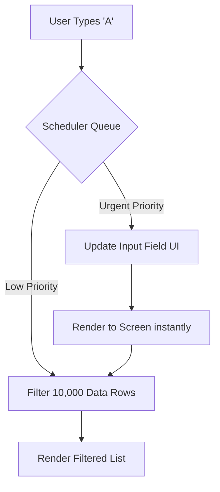

import Tabs from '@theme/Tabs';
import TabItem from '@theme/TabItem';

# Scheduler Priorities

Modern frontend frameworks are evolving beyond synchronous rendering. The **Scheduler** is an internal engine that assigns priority levels to different types of updates. This allows the framework to pause a heavy, low-priority render to immediately process a fast, high-priority user interaction.

:::info[Core Philosophy]
**Not All Updates Are Equal**. Typing in an input field must update the screen instantly (Urgent). Rendering a complex data visualization based on that input can take a few milliseconds (Non-Urgent). The Scheduler ensures the former never waits for the latter.
:::

---

## 1. Easy: Urgent vs. Non-Urgent

By default, every state update in React is treated as **Urgent**. If you type into a search box, and that keystroke triggers a filter over 10,000 items, the browser locks up.

With Concurrent Features, you can split this into two priorities:
-   **Urgent**: Update the input field text.
-   **Transition (Non-Urgent)**: Filter the 10,000 items.



---

## 2. Medium: `useTransition`

The `useTransition` hook allows you to explicitly mark a state update as a "Transition". A Transition tells the Scheduler: *"This update might take a while. It's okay to delay rendering this if something more important happens."*

While the transition is rendering in the background, the UI remains fully responsive.

---

## 3. Hard: Implementation and `useDeferredValue`

What if the slow rendering isn't triggered by an event handler you control (like a user click), but by data coming in from the top of the tree (e.g., props)? You use `useDeferredValue`.

<Tabs groupId="lang" queryString>
<TabItem value="js" label="JavaScript">

```javascript
// Using useTransition for an event handler
import { useState, useTransition } from 'react';

function SearchBox() {
  const [query, setQuery] = useState('');
  const [filteredData, setFilteredData] = useState([]);
  const [isPending, startTransition] = useTransition();

  const handleChange = (e) => {
    // 1. Urgent update (Input feels instant)
    setQuery(e.target.value); 

    // 2. Non-Urgent update (List filtering runs in background)
    startTransition(() => {
      setFilteredData(performHeavyFiltering(e.target.value));
    });
  };

  return (
    <>
      <input value={query} onChange={handleChange} />
      {isPending ? <Spinner /> : <List data={filteredData} />}
    </>
  );
}
```

</TabItem>
<TabItem value="ts" label="TypeScript">

```typescript
// Using useDeferredValue for top-down props
import { useDeferredValue, memo } from 'react';

// The parent passes down a rapidly changing search query.
function SlowList({ query }: { query: string }) {
  // We tell React to keep a "lagging" version of the query.
  // It will only update this value when the main thread is idle.
  const deferredQuery = useDeferredValue(query);
  
  // We can use the difference between the actual query and the 
  // deferred query to show a visual loading state.
  const isStale = query !== deferredQuery;

  return (
    <ul style={{ opacity: isStale ? 0.5 : 1 }}>
      {/* Heavy rendering based on the deferred value */}
      {performHeavyFiltering(deferredQuery).map(item => (
        <li key={item.id}>{item.name}</li>
      ))}
    </ul>
  );
}

export default memo(SlowList);
```

</TabItem>
</Tabs>

---

## 4. Advanced: Internal Lanes Architecture

React's Scheduler internally uses a bitmask architecture called **Lanes**. Think of Lanes as a multi-lane highway. 
-   **SyncLane (Urgent)**: Discrete user events (clicks, keypresses). These block the main thread.
-   **InputContinuousLane**: Continuous events (scrolling, dragging).
-   **TransitionLane**: Marked via `startTransition`.
-   **IdleLane**: Background tasks (like pre-fetching hidden data).

If a Transition is rendering on its lane and a SyncLane update arrives, the Scheduler **yields** the main thread, processes the SyncLane update, flushes it to the screen, and then resumes (or restarts) the Transition rendering.

---

## 5. Interview Prep: 4 Key Questions

### Q1: What is the primary difference between `setTimeout` and `useTransition`?
**A:** `setTimeout` delays the *execution* of the state update, but once the timeout fires, the resulting render is still fully synchronous and blocks the main thread. `useTransition` executes the state update immediately, but tells the Scheduler to render the resulting UI changes *interruptibly*. If the user types another key while the transition is rendering, React will pause the transition, render the new key, and then resume.

### Q2: Why is `useDeferredValue` often paired with `React.memo`?
**A:** `useDeferredValue` creates a lagging copy of a prop. However, if the parent component re-renders due to the urgent state change, the child component will also naturally re-render, defeating the purpose of deferring the value. By wrapping the heavy child component in `React.memo`, you ensure it only re-renders when the `deferredValue` actually changes during an idle browser cycle.

### Q3: How do Scheduler priorities improve "Interaction to Next Paint" (INP)?
**A:** INP measures how long it takes for the UI to visually respond to a user interaction. By marking heavy DOM updates as Transitions, the Scheduler ensures the initial visual feedback (like a button click state or typing a letter) is processed in the Urgent Lane. This drops the INP time down to a few milliseconds, regardless of how long the subsequent heavy data rendering takes.

### Q4: Does `useTransition` replace Debouncing?
**A:** No, they solve different problems. Debouncing prevents a function (like a network request) from firing until the user stops typing, saving server load. `useTransition` solves UI blocking; it ensures the browser doesn't freeze while rendering large amounts of DOM nodes. You often use them together: debounce the network fetch, and use `useTransition` for the heavy DOM updates when the data returns.
