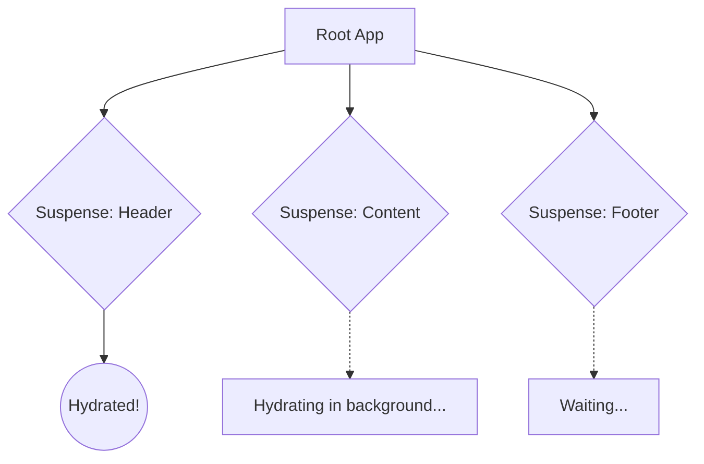

import Tabs from '@theme/Tabs';
import TabItem from '@theme/TabItem';

# Selective Hydration

**Selective Hydration** is an advanced Server-Side Rendering (SSR) optimization introduced in React 18. It allows the framework to prioritize hydrating the specific parts of the DOM that the user is currently interacting with, rather than forcing the user to wait for the entire page to hydrate.

:::info[Core Philosophy]
**Hydrate What Matters**. If a user clicks on the Sidebar while the rest of the application is still booting up, React should immediately pause what it's doing, hydrate the Sidebar to make it interactive, process the click event, and then resume hydrating the rest of the page in the background.
:::

---

## 1. Easy: The Monolithic Hydration Problem

In traditional SSR (React 17 and earlier), hydration was a single, massive, uninterrupted task. 

1.  The server sends the HTML. The user sees the page.
2.  The browser downloads a massive 2MB JavaScript bundle.
3.  React begins **Hydrating** (attaching event listeners to the HTML).
4.  This hydration process locks the main thread for 500ms. If the user clicks a button during this 500ms, the browser is frozen. The click is ignored or severely delayed.

---

## 2. Medium: Enter Suspense Boundaries

React 18 solves this by breaking the application into chunks using `<Suspense>` boundaries.

Instead of hydrating the entire app in one go, React hydrates it piece by piece, starting with the root and working its way down. Crucially, because it works in chunks, React can yield control back to the browser between chunks.



---

## 3. Hard: Prioritization via User Interaction

The true magic of Selective Hydration is how it responds to the user.

Imagine the `Header`, `Content`, and `Footer` are all wrapped in `<Suspense>`. React starts hydrating the `Header`. 

While that's happening, the user clicks a button inside the un-hydrated `Footer`.

React detects the interaction. It immediately stops hydrating the `Content`, boosts the priority of the `Footer`, hydrates the `Footer`, replays the user's click event so it isn't lost, and *then* goes back to hydrating the `Content`.

<Tabs groupId="lang" queryString>
<TabItem value="js" label="JavaScript">

```javascript
// Enabling Selective Hydration
// You simply wrap independent sections of your app in Suspense.
// React's concurrent renderer handles the event interception and prioritization automatically.

import { Suspense, lazy } from 'react';

const HeavySidebar = lazy(() => import('./Sidebar'));
const HeavyFeed = lazy(() => import('./Feed'));

function App() {
  return (
    <Layout>
      {/* If the user clicks the Sidebar, React hydrates it first */}
      <Suspense fallback={<SidebarSkeleton />}>
        <HeavySidebar />
      </Suspense>

      {/* If the user scrolls the Feed, React hydrates it first */}
      <Suspense fallback={<FeedSkeleton />}>
        <HeavyFeed />
      </Suspense>
    </Layout>
  );
}
```

</TabItem>
<TabItem value="ts" label="TypeScript">

```typescript
// Server-Side Streaming
// Selective Hydration works hand-in-hand with Streaming SSR.
import { renderToPipeableStream } from 'react-dom/server';

app.use('/', (req, res) => {
  const { pipe } = renderToPipeableStream(<App />, {
    // The server immediately sends the shell (the skeletons)
    // As the Heavy components finish loading on the server, 
    // they are streamed down to the browser.
    onShellReady() {
      res.setHeader('content-type', 'text/html');
      pipe(res);
    }
  });
});
```

</TabItem>
</Tabs>

---

## 4. Advanced: Event Replay Architecture

How does React "replay" an event on a component that hasn't been hydrated yet?

During the initial server render, React attaches a lightweight, global event listener to the `document` root. This listener captures all clicks, hovers, and inputs. 

If an event fires on a DOM node that is inside an un-hydrated Suspense boundary, React stores the event in a queue and triggers the priority hydration. Once the specific component finishes hydrating, React pulls the exact event out of the queue and explicitly dispatches it onto the newly hydrated React component, exactly as if the user had just clicked it.

---

## 5. Interview Prep: 4 Key Questions

### Q1: What is the main metric that Selective Hydration improves?
**A:** Time to Interactive (TTI) and First Input Delay (FID) / Interaction to Next Paint (INP). By not forcing the user to wait for the entire application to hydrate, the specific components the user cares about become interactive much faster.

### Q2: Why is `renderToString` obsolete in modern React architecture?
**A:** `renderToString` is a synchronous, blocking server API. It must wait for all data to fetch on the server, and it sends the HTML down in one massive chunk, which forces monolithic hydration on the client. `renderToPipeableStream` allows the server to stream HTML in chunks via Suspense boundaries, which unlocks Selective Hydration on the client.

### Q3: What happens if a user clicks an un-hydrated button, and then clicks another un-hydrated button before the first one finishes hydrating?
**A:** React's global event listener queues both events. It will boost the priority of the first button's boundary, hydrate it, and replay the first event. Then it will boost the priority of the second button's boundary, hydrate it, and replay the second event.

### Q4: Does Selective Hydration work without `<Suspense>`?
**A:** No. `<Suspense>` boundaries are the architectural markers that tell React where it is allowed to slice up the hydration process. If your app does not use Suspense, React is forced to hydrate the entire application as a single, indivisible block.
