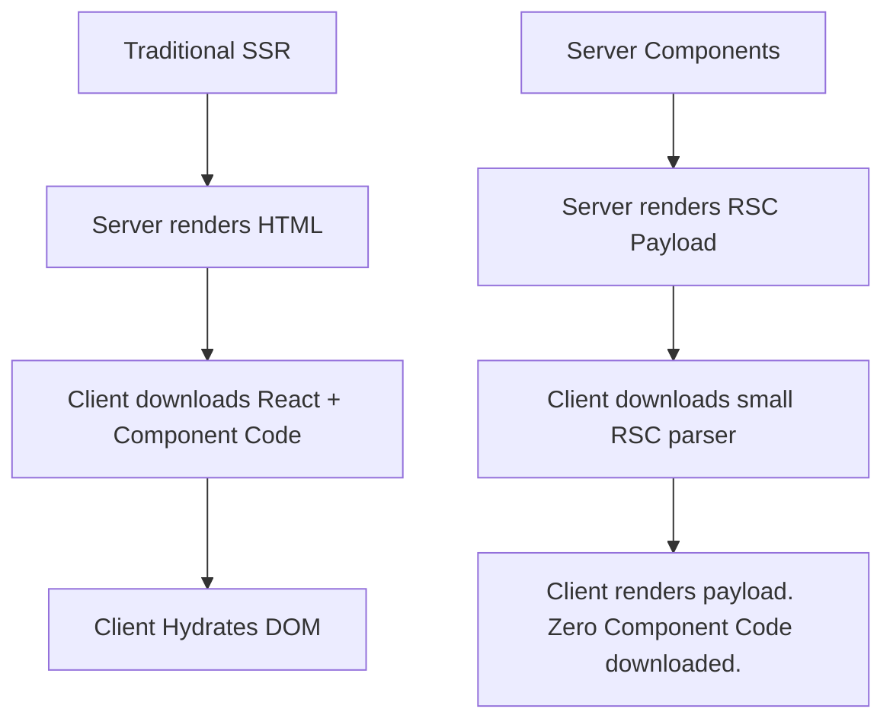

import Tabs from '@theme/Tabs';
import TabItem from '@theme/TabItem';

# Server Components

**React Server Components (RSC)** is an architectural paradigm that fundamentally splits a React application into two distinct environments: the Server and the Client. Server Components render exclusively on the server and their dependencies are never shipped to the browser.

:::info[Core Philosophy]
**Zero Bundle Size**. If you import a massive 5MB Markdown parsing library to render a blog post, traditional React ships that 5MB library to the user. With Server Components, the markdown is parsed on the server, and only the resulting `<h1>` and `<p>` tags are sent to the browser.
:::

---

## 1. Easy: RSC vs. SSR

Server-Side Rendering (SSR) and React Server Components (RSC) sound similar but are entirely different concepts.

-   **SSR**: Renders your component tree to an HTML string. The browser downloads the HTML, and then it downloads the exact same component logic via JavaScript to "hydrate" the HTML and make it interactive.
-   **RSC**: Renders your component tree to a special serialized JSON format. The browser downloads this format, renders it, and **never downloads the JavaScript for those components**. They are static and cannot have state or effects.



---

## 2. Medium: Interleaving Client and Server

Because Server Components cannot use `useState`, `useEffect`, or event listeners like `onClick` (those only exist in a browser), you must use **Client Components** for interactivity.

You designate a Client Component by adding the `"use client"` directive at the top of the file.

The magic of RSC is that you can interleave them. A Server Component can render a Client Component, which can accept another Server Component as a child.

---

## 3. Hard: The Serialization Boundary

When a Server Component passes props to a Client Component, those props must cross the network boundary. This means **props must be serializable**. You can pass strings, numbers, arrays, and objects, but you **cannot pass functions or classes**.

<Tabs groupId="lang" queryString>
<TabItem value="js" label="JavaScript">

```javascript
// ServerComponent.js
// This runs exclusively on the server.
import db from './database';
import InteractiveButton from './ClientButton';

export default async function BlogPost({ postId }) {
  // We can securely access the database directly inside the component!
  const post = await db.query('SELECT * FROM posts WHERE id = ?', postId);
  
  return (
    <article>
      <h1>{post.title}</h1>
      <p>{post.content}</p>
      
      {/* We pass serializable data to the Client Component */}
      <InteractiveButton postId={post.id} />
    </article>
  );
}
```

</TabItem>
<TabItem value="ts" label="TypeScript">

```typescript
// ClientButton.tsx
"use client"

import { useState } from 'react';

// This component is shipped to the browser bundle.
export default function InteractiveButton({ postId }: { postId: number }) {
  const [likes, setLikes] = useState(0);

  return (
    <button onClick={() => setLikes(likes + 1)}>
      Like Post {postId} ({likes})
    </button>
  );
}
```

</TabItem>
</Tabs>

---

## 4. Advanced: The RSC Payload Format

When a Server Component is rendered, it doesn't output HTML. It outputs a streaming, line-by-line format that looks like this:

```text
M1:{"id":"./src/ClientButton.tsx","name":"","chunks":["app/ClientButton"],"async":false}
S2:"<article><h1>Hello World</h1><p>Content</p>"
J0:["$", "article", null, {"children": [
  "@2",
  ["$","@1", null, {"postId": 42}]
]}]
```

1.  **M (Module Reference)**: Tells the client: *"I am about to render a Client Component. Please go download the JavaScript chunk `app/ClientButton`."*
2.  **S (Static String)**: Static HTML that can be dumped directly into the DOM.
3.  **J (JSON Tree)**: The actual React Element tree structure tying it all together.

Because it streams in chunks, the browser can start building the DOM while the server is still querying the database.

---

## 5. Interview Prep: 4 Key Questions

### Q1: Why can't you import a Server Component inside a Client Component?
**A:** Because the Client Component runs in the browser. If it imported a Server Component, the bundler would be forced to download the Server Component's code (which might contain sensitive database logic or massive libraries) into the browser, defeating the entire purpose of RSC. 

### Q2: If you can't import a Server Component into a Client Component, how do you interleave them?
**A:** You use the `children` prop (or any other prop that accepts React Nodes). A Server Component can render a Client Component and pass another Server Component to it as `children`. The Client Component never imports the Server Component; it just renders `{children}`.

### Q3: What is the `"use client"` directive really doing?
**A:** It is a bundler directive (used by Webpack/Turbopack). It tells the bundler: *"Stop server-side execution here. Create a network boundary. Put this file and all of its dependencies into a separate JavaScript chunk, and send that chunk to the browser."*

### Q4: Do Server Components eliminate the need for APIs?
**A:** In many cases, yes. Because Server Components run on the server, you can query your database, read the file system, or hit internal microservices directly inside the component body using `async/await`. You no longer need to expose a public REST API or GraphQL endpoint just to fetch initial page data.
