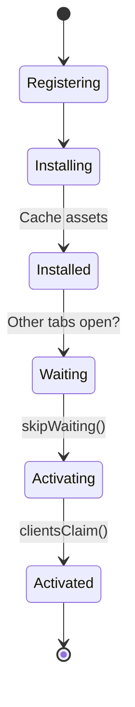

import Tabs from '@theme/Tabs';
import TabItem from '@theme/TabItem';

# Service Worker Lifecycle Traps

The **Service Worker Lifecycle** is one of the most complex parts of PWA development. Because Service Workers are designed to work offline and control the network, the browser is extremely strict about how they are installed and updated to prevent "corrupted" versions of your app from being cached forever.

:::info[Core Philosophy]
**Stability First**. Browsers will never replace an active Service Worker if its controlled tabs are still open. This "waiting" state ensures that a user isn't suddenly switched to a new version of your app in the middle of a session.
:::

---

## 1. Easy: The Registration Flow

Unlike regular scripts, a Service Worker must be **Registered**. Once registered, it goes through an installation phase where it typically pre-caches assets.



---

## 2. Medium: The "Waiting" Trap

The most common "bug" in PWA development is the **update that never happens**. 
If you change your SW script and refresh the page, the new SW will register and install, but it will sit in the **"Waiting"** state. It will only take over when **all** open tabs of your site are closed.

---

## 3. Hard: Implementation and Force-Clearing

<Tabs groupId="lang" queryString>
<TabItem value="js" label="JavaScript">

```javascript
// Registering with an Update Check
if ('serviceWorker' in navigator) {
  navigator.serviceWorker.register('/sw.js').then(reg => {
    reg.addEventListener('updatefound', () => {
      const newWorker = reg.installing;
      newWorker.addEventListener('statechange', () => {
        if (newWorker.state === 'installed' && navigator.serviceWorker.controller) {
          console.log('New update available! Please refresh.');
        }
      });
    });
  });
}

// sw.js (Internal Force Update)
self.addEventListener('install', (event) => {
  // Move to activating state immediately
  self.skipWaiting();
});

self.addEventListener('activate', (event) => {
  // Take control of all open tabs immediately
  event.waitUntil(clients.claim());
});
```

</TabItem>
<TabItem value="ts" label="TypeScript">

```typescript
// Typing the lifecycle events
const sw = self as unknown as ServiceWorkerGlobalScope;

sw.addEventListener('install', (event: ExtendableEvent) => {
  event.waitUntil(
    caches.open('v1').then(cache => {
      return cache.addAll(['/', '/styles.css', '/app.js']);
    })
  );
});

sw.addEventListener('fetch', (event: FetchEvent) => {
  event.respondWith(
    caches.match(event.request).then(res => res || fetch(event.request))
  );
});
```

</TabItem>
</Tabs>

---

## 4. Advanced: The Byte-for-Byte Check

How does the browser know the Service Worker has changed? 
1. It performs a **byte-for-byte** comparison of the `sw.js` file. Even a single character change (like a version string) triggers an update.
2. The browser automatically checks for updates on page navigation or every **24 hours**. 
3. **Trap**: If your server caches the `sw.js` file for a long time (via `Cache-Control` headers), the browser might not see the update, effectively "killing" your ability to update your app.

---

## 5. Interview Prep: 4 Key Questions

### Q1: Why does a new Service Worker wait to activate?
**A:** To ensure **Application Consistency**. If a site is open in two tabs and one tab starts using a new SW (which might have a different caching strategy or API format) while the other tab uses the old one, it could lead to shared data corruption (like IndexedDB conflicts) or inconsistent UI states.

### Q2: What is the difference between `skipWaiting()` and `clients.claim()`?
**A:** `skipWaiting()` works on the **Service Worker** level; it tells the installing SW to bypass the "waiting" state and become "active" immediately. `clients.claim()` works on the **Pages** level; it tells the newly active SW to start controlling existing tabs immediately, rather than waiting for the next page reload.

### Q3: How do you notify a user that an update is available?
**A:** Use the `updatefound` event on the Service Worker registration. When the state changes to `installed` and a `controller` (an old SW) is already present, you show a UI notification (like a "Refresh to Update" toast). When clicked, you can send a message to the new SW to call `skipWaiting()`.

### Q4: Why should Service Worker scripts never be cached with `Cache-Control` headers?
**A:** If the `sw.js` file is cached by the browser for (e.g.) 1 year, the browser will never reach out to your server to see if a new byte-for-byte version exists. This effectively traps the user on the current version of the Service Worker and the current cache assets until they manually clear their browser data.
