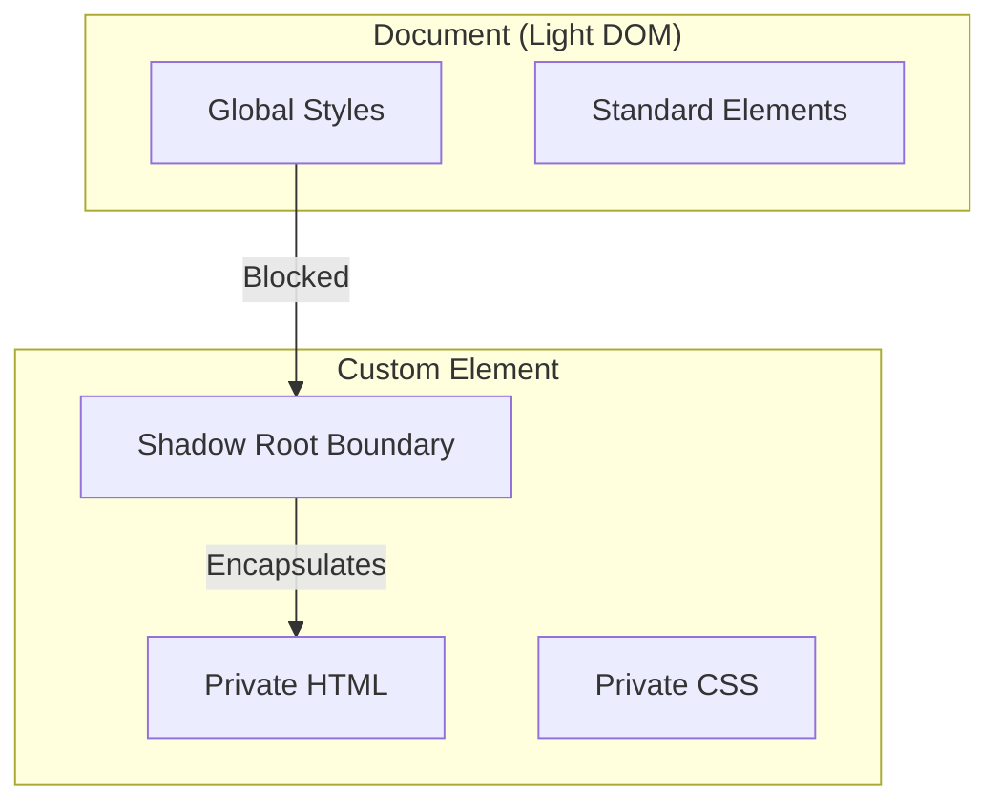

import Tabs from '@theme/Tabs';
import TabItem from '@theme/TabItem';

# Shadow DOM

**Shadow DOM** is one of the three main Web Component standards. It provides a way to attach a hidden, isolated DOM tree to an element, preventing styles and scripts from "leaking" out of or into the component.

:::info[Core Philosophy]
**Scope Isolation**. Shadow DOM essentially creates a "private room" for an element's HTML and CSS. Global CSS rules cannot enter the room, and the room's CSS cannot affect the rest of the house.
:::

---

## 1. Easy: The Global CSS Nightmare

In standard HTML (Light DOM), CSS is global. If you define `.button { color: red; }`, every button on the page turns red. This makes large-scale applications brittle.

**Shadow DOM** solves this by creating a "Shadow Root". Anything inside this root is invisible to global CSS selectors.



---

## 2. Medium: Open vs. Closed Modes

When you create a Shadow Root, you must choose a `mode`:

- **Open**: The shadow root can be accessed via JavaScript from the outside (`element.shadowRoot`). This is the industry standard.
- **Closed**: The shadow root is inaccessible from the outside. While it sounds more "secure," it makes testing and certain library integrations extremely difficult.

---

## 3. Hard: Shadow Scoping and Slots

Shadow DOM introduces and uses special CSS pseudo-elements and selectors to handle the boundary:

- **`:host`**: Styles the actual custom element from *inside* the shadow DOM.
- **`::slotted()`**: Styles elements that are passed into the component via a `<slot>`.
- **`::part()`**: Allows the outside world to style specific parts of the component if they are explicitly "exposed".

<Tabs groupId="lang" queryString>
<TabItem value="js" label="JavaScript">

```javascript
class MyComponent extends HTMLElement {
  constructor() {
    super();
    // 1. Create the Shadow Root
    const shadow = this.attachShadow({ mode: 'open' });

    // 2. Define internal HTML/CSS
    shadow.innerHTML = `
      <style>
        :host { display: block; border: 1px solid black; }
        p { color: blue; } /* Won't affect global p tags */
      </style>
      <p>I am protected!</p>
      <slot></slot> <!-- Where external content goes -->
    `;
  }
}
customElements.define('my-comp', MyComponent);
```

</TabItem>
<TabItem value="ts" label="TypeScript">

```typescript
class IsolatedBox extends HTMLElement {
  private _shadowRoot: ShadowRoot;

  constructor() {
    super();
    this._shadowRoot = this.attachShadow({ mode: "open" });
  }

  connectedCallback(): void {
    this._shadowRoot.innerHTML = `
      <style>
        .box { padding: 20px; background: #eee; }
      </style>
      <div class="box">
        <slot name="header"></slot>
        <slot></slot>
      </div>
    `;
  }
}
customElements.define("isolated-box", IsolatedBox);
```

</TabItem>
</Tabs>

---

## 4. Advanced: Event Retargeting

To maintain encapsulation, the Shadow DOM "retargets" events. If a user clicks a button *inside* your Shadow DOM, the event that bubbles up to the main document will appear to come from the **Custom Element itself**, not the internal button.

**The `composedPath()`**: If you need to see exactly what was clicked inside the shadow root, you must use `event.composedPath()`, which returns an array of all elements the event passed through, including those behind the shadow boundary.

---

## 5. Interview Prep: 4 Key Questions

### Q1: What is the difference between "Light DOM" and "Shadow DOM"?
**A:** Light DOM is the regular, global DOM tree of an HTML document where CSS and JS are globally accessible. Shadow DOM is a private, scoped DOM tree attached to a specific element. Styles defined in Shadow DOM do not leak out, and global styles (except CSS variables and inherited properties) do not leak in.

### Q2: How do you style a Custom Element from the inside?
**A:** You use the `:host` CSS selector. It selects the custom element that is hosting the Shadow DOM. To style it based on a specific state (like an attribute), you can use `:host([disabled])` or `:host(.active)`.

### Q3: Explain how the `<slot>` element handles content.
**A:** Slots are "placeholders" inside your Shadow DOM template. When a user puts HTML inside your custom element tags, that HTML is "projected" into the slot. Crucially, that slotted content **remains part of the Light DOM** (for styling and event purposes) but is visually rendered inside your component.

### Q4: Why is `mode: 'closed'` rarely used in production?
**A:** Because it provides a false sense of security. It makes the `shadowRoot` property return `null` globally, which breaks most testing utilities (like Jest/Testing Library) and prevents legitimate DOM manipulation from external tools or browser extensions. `mode: 'open'` is preferred for observability and interoperability.
