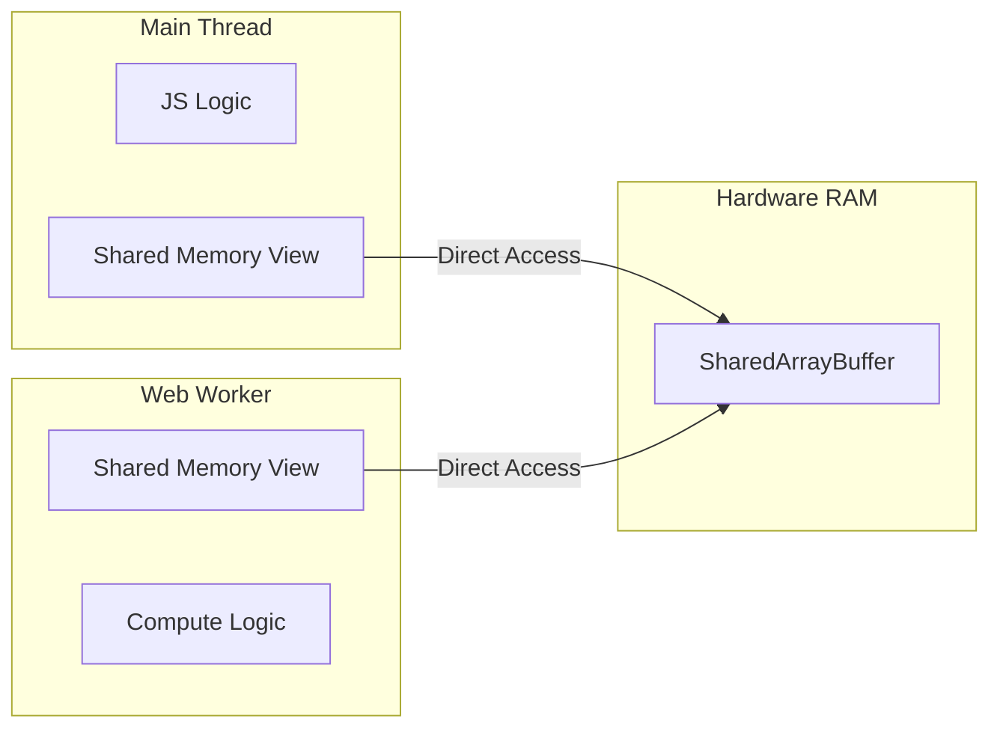

import Tabs from '@theme/Tabs';
import TabItem from '@theme/TabItem';

# Shared Array Buffer

**SharedArrayBuffer (SAB)** is a memory object used to share a raw block of data between the main thread and multiple Web Workers. Unlike standard `ArrayBuffer` objects which are "transferred" (moving ownership), an SAB is accessible by all threads simultaneously.

:::info[Core Philosophy]
**Zero-Copy Communication**. Instead of sending messages back and forth via `postMessage` (which clones data), multiple threads can read and write to the exact same physical memory location, drastically increasing performance for heavy computations.
:::

---

## 1. Easy: The Problem with postMessage

When you send a large array (e.g., 50MB) to a Worker using standard `postMessage`, the browser **clones** that data. This takes time and doubles the memory usage. 

**SharedArrayBuffer** allows the Worker and the Main Thread to point to the same 50MB block. 



---

## 2. Medium: Thread Safety and Atomics

If two threads try to increment a number in the same memory location at the same time, you get a **Race Condition**. 

```javascript
// Thread A: Read (10) -> Add 1 (11) -> Write (11)
// Thread B: Read (10) -> Add 1 (11) -> Write (11)
// Result: 11 (Should have been 12!)
```

To fix this, JavaScript provides the **`Atomics`** API. These operations are "atomic"—they are guaranteed to finish completely before another thread can access the data.

---

## 3. Hard: Implementation with Atomics

<Tabs groupId="lang" queryString>
<TabItem value="js" label="JavaScript">

```javascript
// main.js
const sab = new SharedArrayBuffer(1024); // 1KB shared memory
const int32 = new Int32Array(sab);
const worker = new Worker('worker.js');

worker.postMessage(sab);

// Wait for worker to finish work
setTimeout(() => {
  console.log("Result:", Atomics.load(int32, 0));
}, 1000);

// worker.js
self.onmessage = (evt) => {
  const int32 = new Int32Array(evt.data);
  
  // Safe atomic addition
  Atomics.add(int32, 0, 1);
};
```

</TabItem>
<TabItem value="ts" label="TypeScript">

```typescript
// main.ts
const buffer = new SharedArrayBuffer(Int32Array.BYTES_PER_ELEMENT * 1);
const view = new Int32Array(buffer);
const worker = new Worker(new URL("./worker.ts", import.meta.url));

worker.postMessage(buffer);

// worker.ts
self.onmessage = (event: MessageEvent<SharedArrayBuffer>) => {
  const view = new Int32Array(event.data);
  
  // Atomic increment: guaranteed to be thread-safe
  Atomics.add(view, 0, 5); 
  
  // Notify main thread if it's waiting (Advanced)
  Atomics.notify(view, 0, 1);
};
```

</TabItem>
</Tabs>

---

## 4. Advanced: Cross-Origin Isolation (Security)

SharedArrayBuffer was temporarily disabled due to the **Spectre** and **Meltdown** vulnerabilities, which allowed malicious scripts to read sensitive memory using high-precision timers.

To use SAB today, your server **must** send two security headers:
1.  `Cross-Origin-Opener-Policy: same-origin`
2.  `Cross-Origin-Embedder-Policy: require-corp`

Without these, `SharedArrayBuffer` will be undefined, and high-resolution timers (`performance.now()`) will be throttled.

---

## 5. Interview Prep: 4 Key Questions

### Q1: What is the main difference between ArrayBuffer and SharedArrayBuffer?
**A:** An `ArrayBuffer` can only be owned by one thread at a time. To share it, you must "transfer" it, which makes it unusable in the original thread. A `SharedArrayBuffer` can be mapped by multiple threads simultaneously, allowing shared access to the same raw bytes without performance-heavy serialization.

### Q2: Why is the `Atomics` API necessary?
**A:** Because JavaScript is no longer strictly single-threaded when using SAB. Without `Atomics`, you would suffer from race conditions where multiple threads try to modify the same byte at once, leading to corrupted data. `Atomics` ensures memory operations are performed predictably and sequentially across threads.

### Q3: Explain `Atomics.wait()` and `Atomics.notify()`.
**A:** This is a low-level synchronization primitive. `Atomics.wait()` puts a Worker thread to sleep until a specific value in a SharedArrayBuffer changes. `Atomics.notify()` wakes up the sleeping threads. This allows for efficient signaling between threads without the overhead of `postMessage`.

### Q4: What are the security requirements for using SharedArrayBuffer?
**A:** Due to hardware-level CPU vulnerabilities like Spectre, SAB requires a "Cross-Origin Isolated" environment. This is achieved by serving your site with `COOP: same-origin` and `COEP: require-corp` headers. This isolation prevents other origins from accessing your memory space.
