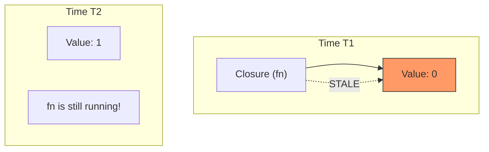

import Tabs from '@theme/Tabs';
import TabItem from '@theme/TabItem';

# Stale Closures

A **stale closure** is one of the most subtle and common bugs in JavaScript and React development. It occurs when a function "captures" a variable from its outer scope, but then continues to reference that old version of the variable even after the outer scope has updated.

:::info[Core Philosophy]
**Temporal Locking**. A closure is created at a specific point in time. It doesn't just reference the variable name; it references the **Lexical Environment** that existed at the exact moment the function was defined.
:::

---

## 1. Easy: What is a Closure?

In JavaScript, a function "remembers" the variables around it even after the outer function has finished executing. This is a closure.

```javascript
function createCounter() {
  let count = 0;
  return function increment() {
    count++; // Accesses 'count' from the outer scope
    console.log(count);
  };
}

const myCounter = createCounter();
myCounter(); // 1
myCounter(); // 2
```

In this easy example, the closure works correctly because `count` is a mutable variable shared by the closure.

---

## 2. Medium: How Closures Become "Stale"

Closures become stale when we replace a variable instead of mutating it (common in React). 

Imagine a function that is created inside a loop or a render cycle. It grabs the value *at that moment*. If that function is executed later (e.g., in a `setTimeout`), it will still use the old value even if the "main" value has changed.



---

## 3. Hard: Stale Closures in React Hooks

This is the most frequent cause of bugs in `useEffect` and `useCallback`. When you define a function inside a component, it is recreated on every render. If you pass that function into an effect or a timer without the correct dependencies, it will be "stale."

<Tabs groupId="lang" queryString>
<TabItem value="js" label="JavaScript">

```javascript
const [count, setCount] = useState(0);

useEffect(() => {
  const timer = setInterval(() => {
    // ❌ BUG: This closure was created when 'count' was 0.
    // It will always calculate 0 + 1 = 1.
    console.log("Count is:", count); 
    setCount(count + 1); 
  }, 1000);

  return () => clearInterval(timer);
}, []); // Empty deps means this ONLY runs once with count=0
```

</TabItem>
<TabItem value="ts" label="TypeScript">

```typescript
const [data, setData] = useState<string>("");

const logData = useCallback(() => {
  // ❌ STALE: If [ ] is empty, this always logs the initial empty string.
  console.log(data);
}, []); 

// ✅ FIX: Functional updates avoid the need for the value in the closure's scope
setCount(prev => prev + 1);
```

</TabItem>
</Tabs>

---

## 4. Advanced: The "Latest Value" Pattern (`useRef`)

When you truly need a stable function reference that always accesses the *latest* value without triggering re-renders or dependency changes, you use the **`useRef` mirror pattern**.

Since a `ref.current` is a mutable reference that stays the same across renders, a closure that points to `ref.current` will always see the most up-to-date data.

```javascript
function useLatest(value) {
  const ref = useRef(value);
  
  // Update the ref on every render
  useEffect(() => {
    ref.current = value;
  });
  
  return ref;
}

// Usage in a component:
const latestCount = useLatest(count);
const handleClick = useCallback(() => {
  // This function is STABLE (never changes reference)
  // But it ALWAYS logs the correct, latest count!
  console.log(latestCount.current);
}, [latestCount]); // latestCount ref itself is stable
```

---

## 5. Interview Prep: 4 Key Questions

### Q1: What is the technical definition of a Stale Closure?
**A:** A stale closure occurs when a function captures a variable from its Lexical Environment, but that variable is subsequently unreachable or "locked" at an old value because the closure was not updated when the variable changed (usually due to missing dependencies in a hook or improper timer management).

### Q2: Why does the "Functional Update" pattern (`setCount(c => c + 1)`) solve stale closures?
**A:** Because the function passed to `setCount` is executed by React *at the exact moment* the state is updated. React provides the most current state value as an argument to that function, meaning the function doesn't have to rely on capturing the variable from its own (potentially stale) outer scope.

### Q3: How do `setInterval` and `setTimeout` contribute to stale closure bugs?
**A:** Timers are often initialized once (in a `useEffect` with `[]` deps). The callback function passed to the timer is created once and captures the state at that specific moment. Unless the timer is cleared and re-initialized when state changes, that callback will continue to use the values it captured during its single creation.

### Q4: Explain the trade-off of the `useRef` latest-value pattern.
**A:** The primary benefit is **Referential Stability**—you can pass a function to a memoized child without it ever changing. The trade-off is that `ref` updates happen outside of React's "render" flow (they are side-effects). You cannot use `ref.current` *during* the render phase (JSX) because it might lead to inconsistent UI states; it should only be accessed in event handlers or effects.
