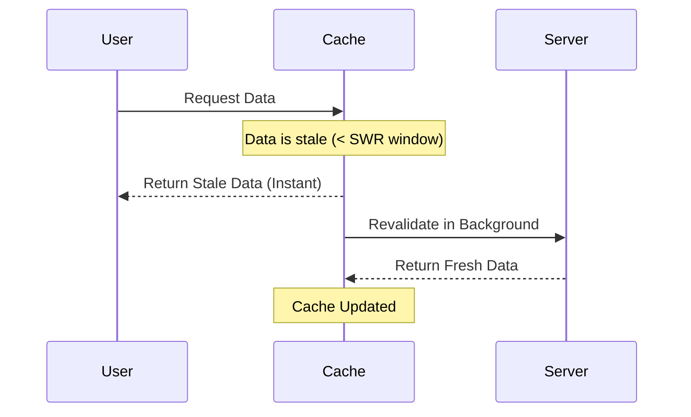

import Tabs from '@theme/Tabs';
import TabItem from '@theme/TabItem';

# Stale-While-Revalidate

**Stale-While-Revalidate (SWR)** is a caching strategy that prioritizes speed by serving "stale" (cached) data immediately, while simultaneously triggering a "revalidation" (fetch) in the background to update the cache for the next request.

:::info[Core Philosophy]
**Speed over Freshness**. SWR accepts that being "slightly wrong" for a split second is better than making the user wait for a network round-trip. It is the perfect strategy for data that changes frequently but isn't mission-critical.
:::

---

## 1. Easy: The HTTP Header

Modern browsers and CDNs support SWR natively via the `Cache-Control` header.

`Cache-Control: max-age=60, stale-while-revalidate=3600`

1.  **0-60s**: The resource is fresh. Serve from cache.
2.  **60s-3600s**: The resource is stale. Serve from cache *immediately*, but fetch a new version in the background.
3.  **>3600s**: The resource is dead. Must fetch from origin before serving.



---

## 2. Medium: The SWR Pattern in Hooks

Libraries like `swr` (Next.js) or `React Query` brought this concept to frontend state management.

-   **Caching**: Stores first-load data.
-   **Revalidation**: Syncs with server on focus, network reconnect, or interval.
-   **Local Mutation**: Updates the UI instantly while waiting for the server to confirm the change (Optimistic UI).

---

## 3. Hard: Implementation and Service Workers

<Tabs groupId="lang" queryString>
<TabItem value="js" label="JavaScript">

```javascript
// Implementing SWR logic in a Service Worker
self.addEventListener('fetch', (event) => {
  event.respondWith(
    caches.open('swr-cache').then((cache) => {
      return cache.match(event.request).then((cachedResponse) => {
        // Fetch from network in background
        const networkFetch = fetch(event.request).then((networkResponse) => {
          cache.put(event.request, networkResponse.clone());
          return networkResponse;
        });

        // Return cached version if it exists, else wait for network
        return cachedResponse || networkFetch;
      });
    })
  );
});
```

</TabItem>
<TabItem value="ts" label="TypeScript">

```typescript
// SWR Hook logic (Simplified)
const useSWR = <T>(key: string, fetcher: (k: string) => Promise<T>) => {
  const [data, setData] = useState<T | null>(cache.get(key));

  useEffect(() => {
    fetcher(key).then(freshData => {
      cache.set(key, freshData);
      setData(freshData);
    });
  }, [key]);

  return data;
};
```

</TabItem>
</Tabs>

---

## 4. Advanced: Consistency Challenges

1.  **Multiple Updates**: If a user updates data on Page A and navigates to Page B, SWR might show the old data for a second before the revalidation kicks in. This "UI flicker" can be confusing.
2.  **State Management**: SWR requires a global cache key system to ensure that when one component triggers a revalidation, all other components using that data are updated automatically.

---

## 5. Interview Prep: 4 Key Questions

### Q1: What is the primary benefit of SWR?
**A:** The primary benefit is **Instant UX**. By serving stale data, you achieve a Time-to-Interactive (TTI) of effectively 0ms for repeat visits. The user never sees a loading spinner, and the data is kept fresh enough for most non-critical use cases (like news feeds, social posts, or profile info).

### Q2: When should you NOT use Stale-While-Revalidate?
**A:** SWR should be avoided for **high-precision, real-time data** where seeing stale information is dangerous or highly confusing. Examples include bank balances, checkout totals, stock prices, or medical records. In these cases, a "Cache-First" or "Network-Only" strategy is safer.

### Q3: How does SWR help with "Offline Support"?
**A:** SWR naturally gracefully degrades into an offline mode. If the network revalidation fails (because the user is on a plane or subway), the strategy simply ends with the stale data. The UI remains functional using the cached state, whereas a Network-First strategy would fail entirely.

### Q4: Explain "Optimistic UI" in the context of SWR.
**A:** Optimistic UI is when you update the local SWR cache **before** the server responds to a mutation (like "Liking" a post). SWR libraries allow you to manually mutate the cache to show the "Liked" state instantly, and then they perform a background revalidation to ensure the server and cache are actually in sync.
