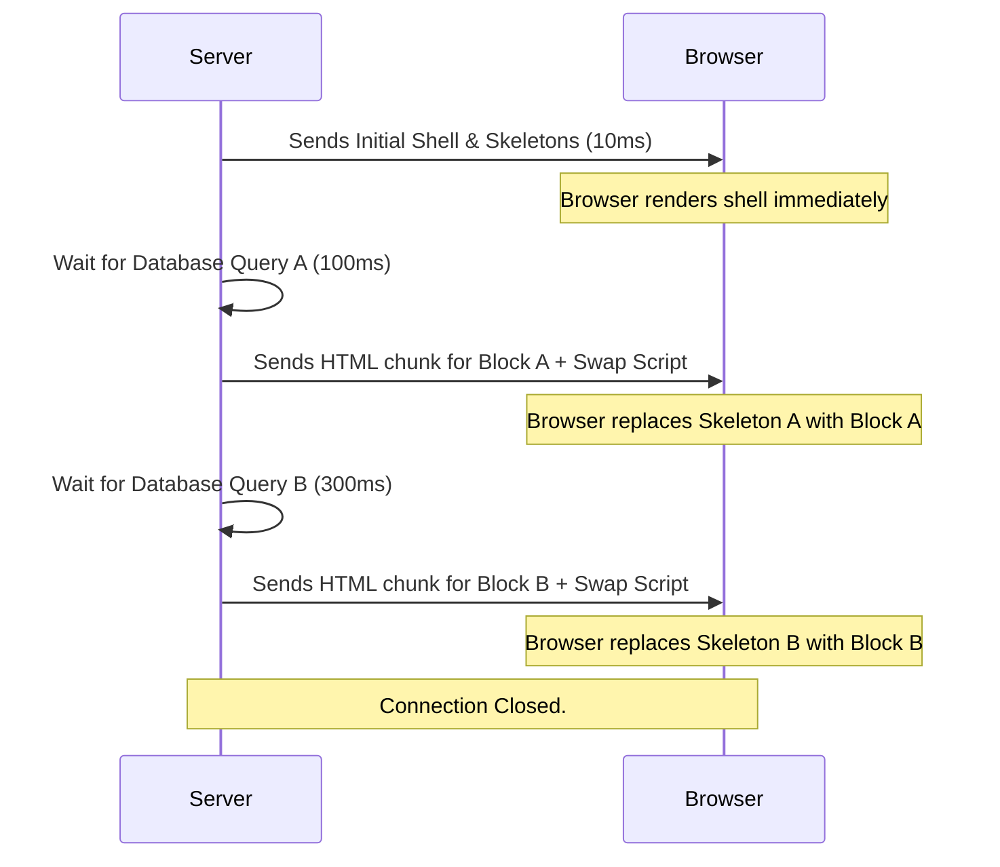

import Tabs from '@theme/Tabs';
import TabItem from '@theme/TabItem';

# Streaming SSR

Streaming Server-Side Rendering (Streaming SSR) allows the server to send the HTML document to the browser in continuous "chunks" as they are generated, rather than waiting for the entire page to compute before sending a single byte.

:::info[Core Philosophy]
**Progressive Delivery**. Instead of the traditional "calculate everything -> stringify -> send" monolith, Streaming SSR leverages native HTTP chunked transfer encoding alongside React `<Suspense>` to feed the browser parseable UI elements immediately.
:::

---

## 1. Traditional SSR vs Streaming SSR

In standard SSR (`renderToString`), the server execution is completely blocked if *any* component needs to fetch API data or wait for I/O.
1. Fetch all data.
2. Render entire app to HTML string.
3. Send HTML to browser.
4. Download JS.
5. Hydrate.

With Streaming SSR (`renderToPipeableStream`):
1. Server immediately renders the outer shell (Navbar, Footer, Skeleton loaders).
2. Server forces the HTTP connection to stay open.
3. As internal components (wrapped in Suspense) finish rendering/fetching, their HTML is appended to the stream along with a tiny inline `<script>` that slots the HTML into the correct skeleton placeholder on the client.



---

## 2. API Usage (`renderToPipeableStream`)

In React 18, `renderToPipeableStream` (Node.js) and `renderToReadableStream` (Edge/Web Streams) replace `renderToString`.

<Tabs groupId="lang" queryString>
<TabItem value="js" label="JavaScript">

```javascript
import { renderToPipeableStream } from 'react-dom/server';
import { App } from './App';

export function handleRequest(req, res) {
  let didError = false;

  const stream = renderToPipeableStream(<App />, {
    bootstrapScripts: ['/client-bundle.js'],
    
    // Fired when the initial shell is ready
    onShellReady() {
      res.statusCode = didError ? 500 : 200;
      res.setHeader('Content-type', 'text/html');
      stream.pipe(res);
    },
    
    // Fired when EVERY Suspense boundary has resolved
    onAllReady() {
      console.log('Stream completed.');
    },
    
    onError(err) {
      didError = true;
      console.error(err);
    }
  });
}
```

</TabItem>
<TabItem value="ts" label="TypeScript">

```typescript
import { renderToPipeableStream } from 'react-dom/server';
import { App } from './App';
import type { Request, Response } from 'express';

export function handleRequest(req: Request, res: Response) {
  let didError = false;

  const stream = renderToPipeableStream(<App />, {
    bootstrapScripts: ['/client-bundle.js'],
    
    onShellReady() {
      res.statusCode = didError ? 500 : 200;
      res.setHeader('Content-type', 'text/html');
      stream.pipe(res);
    },
    
    onAllReady() {
      console.log('Stream completed.');
    },
    
    onError(err: unknown) {
      didError = true;
      console.error(err);
    }
  });
}
```

</TabItem>
</Tabs>

:::warning[Important Distinction]
`onShellReady` is specifically for standard Web/Node environments. If you are deploying to Search Engine Crawlers (which might not execute JS to slot chunks in), you must wait for `onAllReady` to send the complete static page.
:::

---

## 3. Interview Prep: 4 Key Questions

### Q1: Does streaming SSR require JavaScript to be enabled on the client to work?
**A:** Yes, partially. For the browser to take the delayed HTML chunks and inject them into the initial `<Suspense>` skeleton fallbacks, React emits tiny inline `<script>` tags alongside the HTML chunks. If JS is perfectly disabled, the user is permanently stuck seeing the initial skeleton shell.

### Q2: What metric does Streaming SSR improve the most?
**A:** TTFB (Time to First Byte) and FCP (First Contentful Paint). Because the server doesn't wait for massive database queries to resolve before sending the `<head>`, CSS, and Layout shell, the user sees visual feedback almost instantly.

### Q3: What happens if a component errors on the server during streaming?
**A:** React catches the error on the server and emits the HTML for the closest `<ErrorBoundary>` down the stream instead of crashing the entire page request.

### Q4: Contrast `renderToPipeableStream` with `renderToReadableStream`.
**A:** `renderToPipeableStream` leverages built-in Node.js `stream.Writable` streams. It is exclusive to Node environments. `renderToReadableStream` is built on standard Web Streams (WHATWG), designed for use in Edge environments like Cloudflare Workers or Deno.
