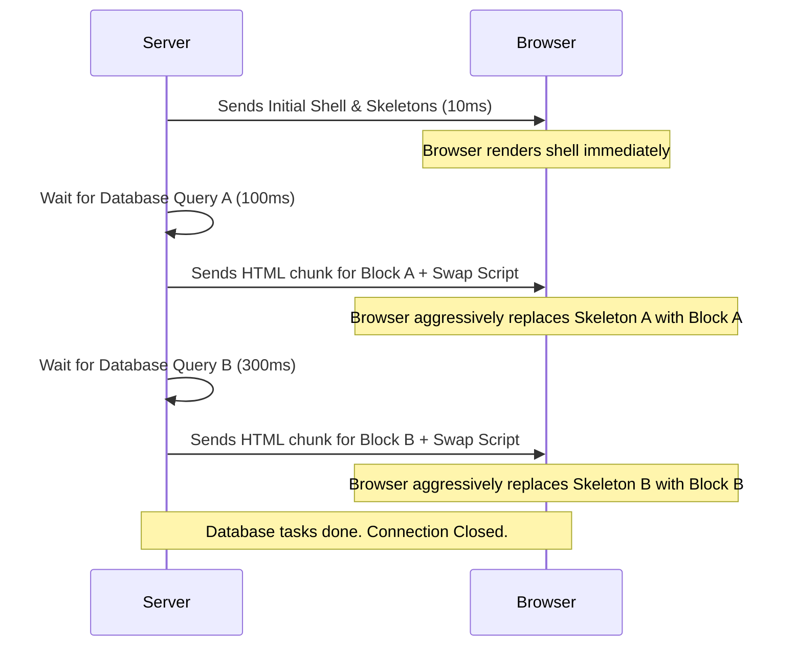

import Tabs from '@theme/Tabs';
import TabItem from '@theme/TabItem';

# Streaming SSR

Streaming Server-Side Rendering (Streaming SSR) allows the server to send the HTML document to the browser in continuous "chunks" as they are generated, rather than waiting for the entire page to compute before sending a single byte.

:::info[Core Philosophy]
**Progressive Delivery**. Instead of the traditional "calculate everything -> stringify -> send" monolith, Streaming SSR leverages native HTTP chunked transfer encoding alongside React `<Suspense>` to feed the browser parseable UI elements immediately.
:::

---

## 1. Easy: The Problem with Traditional SSR

In standard SSR (`renderToString`), the server execution is completely blocked if *any* component needs to fetch API data or wait for I/O.
1. Fetch all data (e.g. wait 2 seconds for a slow DB).
2. Render entire app to HTML string.
3. Send HTML to browser.
4. Download JS.
5. Hydrate.

If a single widget in the footer is slow, the entire page stays blank (white screen) for 2 seconds. The user gets frustrated and leaves.

---

## 2. Medium: The Streaming Pipeline

With Streaming SSR (`renderToPipeableStream`), React doesn't wait.
1. Server immediately renders the outer shell (Navbar, Footer, Skeleton loaders).
2. Server forces the HTTP connection to stay open.
3. As internal components (wrapped in Suspense) finish rendering/fetching, their HTML is appended to the stream along with a tiny inline `<script>`.
4. The browser executes that script instantly to slot the new HTML into the correct skeleton placeholder.



---

## 3. Hard: Implementing the Pipeable Stream

In React 18, `renderToPipeableStream` (Node.js) and `renderToReadableStream` (Edge/Web Streams) replace `renderToString`. This requires direct access to the Node.js server instance.

<Tabs groupId="lang" queryString>
<TabItem value="js" label="JavaScript">

```javascript
import { renderToPipeableStream } from 'react-dom/server';
import { App } from './App';

export function handleRequest(req, res) {
  let didError = false;

  const stream = renderToPipeableStream(<App />, {
    bootstrapScripts: ['/client-bundle.js'],
    
    // Fired when the initial shell is ready instantly
    onShellReady() {
      res.statusCode = didError ? 500 : 200;
      res.setHeader('Content-type', 'text/html');
      stream.pipe(res); // Begin sending chunks!
    },
    
    // Fired when EVERY Suspense boundary has resolved (SEO bots use this)
    onAllReady() {
      console.log('Stream fully completed.');
    },
    
    onError(err) {
      didError = true;
      console.error(err);
    }
  });
}
```

</TabItem>
<TabItem value="ts" label="TypeScript">

```typescript
import { renderToPipeableStream } from 'react-dom/server';
import { App } from './App';
import type { Request, Response } from 'express';

export function handleRequest(req: Request, res: Response) {
  let didError = false;

  const stream = renderToPipeableStream(<App />, {
    bootstrapScripts: ['/client-bundle.js'],
    
    onShellReady() {
      res.statusCode = didError ? 500 : 200;
      res.setHeader('Content-type', 'text/html');
      stream.pipe(res); // Begin sending chunks!
    },
    
    onAllReady() {
      console.log('Stream fully completed.');
    },
    
    onError(err: unknown) {
      didError = true;
      console.error(err);
    }
  });
}
```

</TabItem>
</Tabs>

---

## 4. Advanced: SEO and the `onAllReady` Callback

Search Engine Crawlers (like Googlebot) are notorious for being unpredictable with dynamic JavaScript. Some crawlers do not execute JS, meaning if you stream chunks with `<script>` tags, the bot will only ever index your skeleton shell.

To solve this, React gives you strict control. If you detect the requesting `User-Agent` is a crawler, you can deliberately ignore `onShellReady` and wait until `onAllReady` fires to `stream.pipe(res)`. This forces standard, monolithic SSR processing for bots to guarantee perfect indexing, while humans get the blazing-fast streaming experience.

---

## 5. Interview Prep: 4 Key Questions

### Q1: Does streaming SSR require JavaScript to be enabled on the client to work?
**A:** Yes, partially. For the browser to take the delayed HTML chunks and successfully inject them into the initial `<Suspense>` skeleton fallbacks, React emits tiny inline `<script>` tags alongside the HTML chunks. If JS is perfectly disabled across the browser, the user is permanently stuck seeing the initial skeleton shell because the injection scripts cannot execute.

### Q2: What exact metric does Streaming SSR fundamentally improve?
**A:** **TTFB** (Time to First Byte) and **FCP** (First Contentful Paint). Because the server doesn't wait for massive database queries or external API calls to resolve before sending the `<head>`, CSS, and visual Layout shell, the user sees psychological visual progress almost instantly.

### Q3: What happens if a component crashes/errors on the server during streaming?
**A:** React securely catches the error isolated on the server and emits the pre-calculated HTML payload for the closest `<ErrorBoundary>` down the network stream instead of crashing the entire HTTP request or corrupting the stream.

### Q4: Contrast `renderToPipeableStream` fundamentally with `renderToReadableStream`.
**A:** `renderToPipeableStream` tightly leverages built-in Node.js `stream.Writable` streams and is consequently exclusive purely to Node operating environments. `renderToReadableStream` is built on strictly standard Web Streams (WHATWG), purposefully designed for use in modern Edge execution environments like Cloudflare Workers or Deno.
