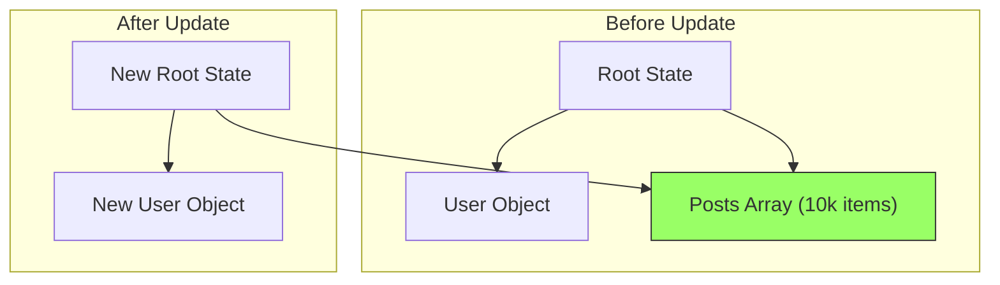
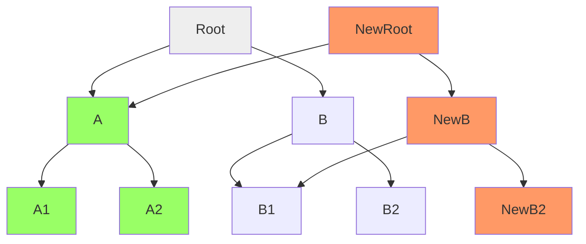

import Tabs from '@theme/Tabs';
import TabItem from '@theme/TabItem';

# Structural Sharing

**Structural sharing** is the architectural bedrock of high-performance immutable state. When updating an object, instead of deep-copying every single property, we reuse the memory of unmodified branches.

:::info[Core Philosophy]
**Persistent Data Structures**. A data structure is "persistent" if it preserves the previous version of itself when modified. Structural sharing allows this without doubling memory consumption for every single change.
:::

---

## 1. Easy: The Pointers Concept

In JavaScript, objects and arrays are stored by **Reference** (memory address). When we "copy" an object using the spread operator `{...obj}`, we are only creating a new top-level container. All the nested objects inside it still point to the *exact same* memory locations as before.

This is the "Sharing" part of Structural Sharing. We don't waste RAM duplicating things that haven't changed.

---

## 2. Medium: The Performance Win

Imagine a global state with a `user` object and a `posts` array containing 10,000 items. If we only update the `user`'s name, we don't need to touch the `posts` array.



**Why this is fast:**
- `StateB.posts === StateA.posts` is `true`. 
- This comparison takes **O(1)** time (one CPU instruction), even if the array has 1 billion items.
- React uses this "Reference Equality" to skip re-rendering huge parts of your app instantly.

---

## 3. Hard: Structural Sharing in Trees

While the spread operator handles shallow sharing, advanced libraries (like Immutable.js) use **Trees** (specifically Hash Array Mapped Tries). When a leaf node changes, only the path from that leaf to the root is recreated. Everything else is shared.


*The green nodes are "Shared" between the old version and the new version.*

---

## 4. Advanced: Implementation in Code

We use the spread operator surgically to preserve references for unchanged sub-trees.

<Tabs groupId="lang" queryString>
<TabItem value="js" label="JavaScript">

```javascript
const state = {
  settings: { theme: "dark" },
  content: { text: "Hello", cache: [/* high memory data */] }
};

// Update ONLY the theme
const nextState = {
  ...state,
  settings: {
    ...state.settings,
    theme: "light"
  }
};

// RESULTS:
console.log(nextState.content === state.content); // true (SHARED reference)
console.log(nextState.settings === state.settings); // false (NEW reference)
```

</TabItem>
<TabItem value="ts" label="TypeScript">

```typescript
interface AppState {
  user: { id: number; name: string };
  data: { bigList: string[] };
}

const updateUserName = (state: AppState, newName: string): AppState => {
  return {
    ...state,
    user: {
      ...state.user,
      name: newName
    }
  };
};

// 'data.bigList' reference is perfectly preserved across state transitions!
```

</TabItem>
</Tabs>

---

## 5. Interview Prep: 4 Key Questions

### Q1: What is the main advantage of structural sharing over deep-copying?
**A:** Performance and Memory. Deep copying an object with 10k items takes **O(n)** time and space. Structural sharing allows updates in **O(1)** time (or **O(log n)** for deeper trees) by reusing existing memory blocks for all unmodified data.

### Q2: How does structural sharing benefit `React.memo`?
**A:** `React.memo` performs a shallow equality check (`prevProps === nextProps`). Because structural sharing preserves references for unchanged data, React can detect "no change" in constant time, allowing it to skip rendering entire subtrees of your application.

### Q3: Can structural sharing lead to Memory Leaks?
**A:** Paradoxically, yes. Because the "new" version of your state keeps references to nodes in the "old" version, the old nodes cannot be garbage collected. If you keep a massive "Undo History" of 1,000 state snapshots, your RAM usage will grow because none of the shared data from the first snapshot can be freed.

### Q4: What is the "Path Copying" technique?
**A:** It is the specific strategy used in persistent trees where, to update a leaf, you copy every node from the root down to that leaf. This creates a new "version" of the tree while the majority of the nodes (siblings of the path) are shared by reference with the previous version.
