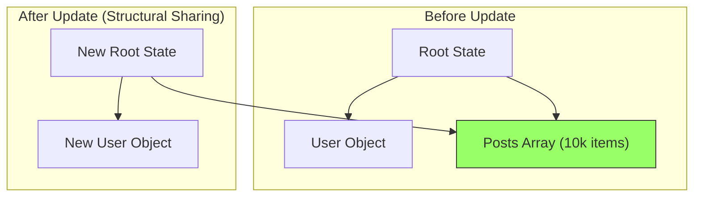
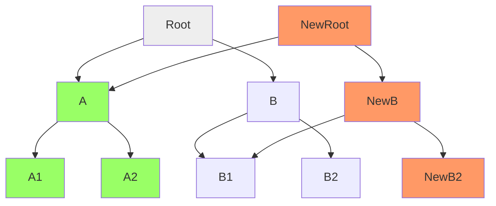

import Tabs from '@theme/Tabs';
import TabItem from '@theme/TabItem';

# Structural Sharing

**Structural sharing** is the architectural bedrock of high-performance immutable state. When updating an object, instead of deep-copying every property, we reuse the memory of unmodified branches.

:::info[Core Philosophy]
**Persistent Data Structures**. A data structure is "persistent" if it preserves the previous version of itself when modified. Structural sharing allows this persistence without doubling memory consumption for every single change.
:::

---

## 1. The Pointers Trap

In JavaScript, objects and arrays are stored by reference. A common mistake in React is thinking a "shallow copy" is slow. In reality, a "deep copy" is the real performance killer.



**What happened here?**
- The `Posts Array` wasn't touched.
- `StateB` simply points to the *exact same memory address* for `posts` as `StateA`.
- This makes the update operation $O(1)$ for the unchanged parts, regardless of how large the data is.

---

## 2. Shared Sub-trees

Structural sharing is even more powerful in **Tree-based** structures (like Hash Array Mapped Tries). Only the "path" from the root to the changed leaf is recreated.



---

## 3. Reference Equality Implementation

How do we implement this in pure JavaScript? We use the **spread operator** surgically.

<Tabs groupId="lang" queryString>
<TabItem value="js" label="JavaScript">

```javascript
const state = {
  header: { title: "Hero" },
  content: { text: "Main body", footer: "Copyright 2024" }
};

// We want to update only the title
const nextState = {
  ...state,
  header: {
    ...state.header,
    title: "New Hero"
  }
};

console.log(nextState.content === state.content); // true (SHARED)
console.log(nextState.header === state.header);   // false (NEW REFERENCE)
```

</TabItem>
<TabItem value="ts" label="TypeScript">

```typescript
interface State {
  header: { title: string };
  content: { text: string; footer: string };
}

const updateTitle = (state: State, newTitle: string): State => {
  return {
    ...state,
    header: {
      ...state.header,
      title: newTitle
    }
  };
};

// nextState shares the 'content' subtree by ref!
```

</TabItem>
</Tabs>

---

## 4. Interview Prep: 4 Key Questions

### Q1: What is the main advantage of structural sharing over deep copying?
**A:** Performance and Memory. Deep copying an object with 10k items requires $O(n)$ time and $O(n)$ space. Structural sharing allows updates in effectively $O(1)$ time (or $O(log\ n)$ for trees) by reusing existing memory references for unchanged data.

### Q2: How does structural sharing benefit React's `memo`?
**A:** `React.memo` and `shouldComponentUpdate` perform shallow equality checks (`prevProps.data === nextProps.data`). If you use structural sharing, unchanged objects keep their references. This allows React to detect "no change" in constant time, skipping entire rendering sub-trees instantly.

### Q3: Can structural sharing lead to Memory Leaks?
**A:** Paradoxically, yes. Because "New State" keeps references to "Old State" nodes, the old nodes cannot be Garbage Collected as long as the new state is in memory. In massive "Undo/Redo" histories or long-running apps, keeping 1,000 snapshots might occupy significantly more memory than a single mutable object.

### Q4: Explain how HAMT (Hash Array Mapped Tries) relates to structural sharing.
**A:** HAMT is the data structure under the hood of **Immutable.js**. It's a high-degree tree where nodes are shared. Because the tree is very wide (e.g., 32 children per node), any update only requires recreating a very shallow path (often only 2-4 nodes), maximizing memory reuse compared to a simple binary tree.
