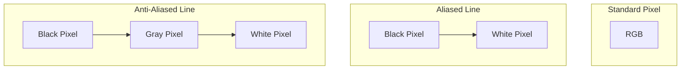

import Tabs from '@theme/Tabs';
import TabItem from '@theme/TabItem';

# Subpixel Rendering

**Subpixel Rendering** is a technique used by browser rendering engines to increase the perceived resolution of text and graphics by addressing the individual red, green, and blue (RGB) sub-components of a physical pixel.

:::info[Core Philosophy]
**Visual Deception**. Since physical pixels are fixed in a grid, the browser uses math (Anti-aliasing) to create the illusion of smooth curves and fractional positions (like `0.5px`) that physically don't exist on the hardware.
:::

---

## 1. Easy: The Pixel Grid

A screen is just a huge grid of squares.
- **Problem**: If you try to draw a diagonal line, it looks "jagged" (aliasing).
- **Solution**: The browser fills surrounding pixels with lighter colors to "soften" the edges. This is **Anti-Aliasing**.



---

## 2. Medium: Fractional Coordinates

In CSS, you can specify `top: 10.5px`. Since the hardware can't light up "half" a pixel, the browser's rasterizer determines how much of that 10.5px falls into Pixel 10 vs. Pixel 11 and blends the colors accordingly.

**Result**: Moving an element by 0.1px increments feels smooth to the eye, even though the physical pixels aren't moving.

---

## 3. Hard: Implementation and Blurring

Subpixel rendering is most visible (and problematic) when working with **GPU Layers**.

<Tabs groupId="lang" queryString>
<TabItem value="js" label="JavaScript">

```javascript
// Predicting and fixing subpixel blur
function fixSubpixelBlur(element) {
  const rect = element.getBoundingClientRect();
  
  // If the browser calculated a fractional position (e.g. 10.333px)
  // the text might look fuzzy. Snap it to the grid.
  const diffX = rect.left - Math.floor(rect.left);
  const diffY = rect.top - Math.floor(rect.top);

  if (diffX !== 0 || diffY !== 0) {
    // Shifting to align with the physical pixel grid
    element.style.transform = `translate(${-diffX}px, ${-diffY}px)`;
  }
}
```

</TabItem>
<TabItem value="ts" label="TypeScript">

```typescript
// Forcing crisp edges on high-DPI screens
const snapToGrid = (val: number): number => {
  const dpr = window.devicePixelRatio || 1;
  // Snap to the nearest physical pixel, not the nearest CSS pixel
  return Math.round(val * dpr) / dpr;
};

const element = document.getElementById("hero-text");
if (element) {
  const x = snapToGrid(10.523);
  element.style.left = `${x}px`;
}
```

</TabItem>
</Tabs>

---

## 4. Advanced: Font Smoothing and GPU Transition

1.  **Font Smoothing**: Browsers like Chrome on macOS use `font-smoothing: antialiased`, which uses grayscale for text. High-performance apps often use this to make text look consistent regardless of the background.
2.  **The GPU "Blur"**: When an element is promoted to its own layer (see GPU Acceleration), the browser often generates a "snapshot" of the text at its current size. If you then scale that layer (`transform: scale(2)`), the text looks blurry because the GPU is scaling a bitmap, not re-rendering the vectors.

**The Fix**: Use `backface-visibility: hidden` or ensure the initial scale is 1.0 at the highest intended resolution.

---

## 5. Interview Prep: 4 Key Questions

### Q1: Why does a 1px border sometimes look thicker or thinner on different screens?
**A:** This is due to the `devicePixelRatio`. On a Retina screen (DPR=2), `1px` in CSS actually equals 2 physical pixels. If you specify `0.5px` border, on a DPR=2 screen it fills exactly 1 physical pixel, looking very sharp. On a standard DPR=1 screen, `0.5px` cannot be rendered perfectly, so the browser uses subpixel blending, which makes the line look "fuzzy" or gray.

### Q2: What happens to subpixel rendering when an element is animated via `transform`?
**A:** During a `transform` animation, the browser often switches the element to a "Compositing Layer" (GPU). To keep the animation at 60fps, it might disable expensive subpixel font-antialiasing and switch to simpler grayscale anti-aliasing. This is why text sometimes appears to "jiggle" or change thickness the moment an animation starts.

### Q3: Explain why `transform: translateZ(0)` is used to fix rendering glitches.
**A:** While it is mostly used for GPU promotion, it also forces the element to stay "on the grid" of its own layer. By isolating the element, it prevents neighboring elements' layout changes from affecting its subpixel alignment, which can resolve "flickering" issues during scrolls or transitions.

### Q4: How does `pixel-rendering: crisp-edges` affect image quality?
**A:** It tells the browser **not** to use subpixel interpolation (smoothing) when scaling images. Instead, it uses a "Nearest Neighbor" algorithm. This is essential for Pixel Art or QR codes, where you want sharp, distinct squares rather than a soft, blurred result.
