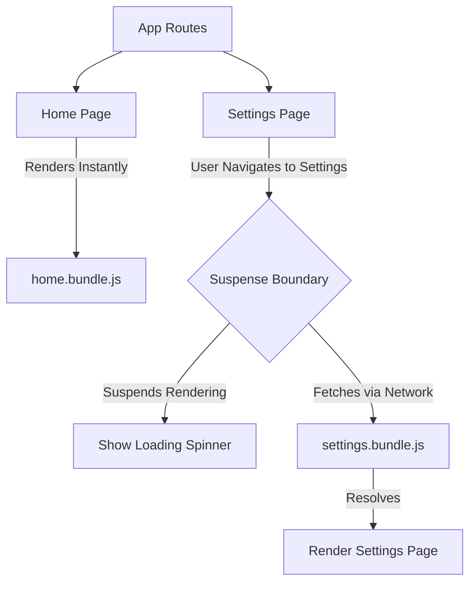

import Tabs from '@theme/Tabs';
import TabItem from '@theme/TabItem';

# Suspense Boundaries

A **Suspense Boundary** (`<Suspense>`) is a declarative component that lets you orchestrate the loading sequence of your UI. It allows a component tree to "suspend" rendering while it waits for some asynchronous operation (like fetching code or data) to finish, displaying a fallback UI in the meantime.

:::info[Core Philosophy]
**Declarative Loading**. Instead of every component manually managing its own `isLoading` state variable, components simply "throw" an unresolved Promise when they need data. The closest `<Suspense>` boundary catches that Promise and displays the fallback until the Promise resolves.
:::

---

## 1. Easy: Code Splitting

The most basic use case for Suspense is **Lazy Loading** components. This splits your JavaScript bundle, ensuring the user only downloads the code for the UI they are actually viewing.



---

## 2. Medium: Data Fetching with Suspense

Historically, Suspense was only for code-splitting. In modern React, it is designed for **Data Fetching**. 

When a component reads from a Suspense-enabled data source (like React Query, Apollo, or Relay), if the data isn't ready, the component suspends. 

This drastically simplifies component logic by entirely removing the need for `if (isLoading) return <Spinner />` boilerplate.

---

## 3. Hard: Implementation and Boundary Placement

<Tabs groupId="lang" queryString>
<TabItem value="js" label="JavaScript">

```javascript
// Basic Lazy Loading with Suspense
import React, { Suspense, lazy } from 'react';

// The browser won't download 'HeavyChart.js' until this is rendered
const HeavyChart = lazy(() => import('./HeavyChart'));

function Dashboard() {
  return (
    <div>
      <h1>Dashboard</h1>
      {/* If HeavyChart is not downloaded yet, show the fallback */}
      <Suspense fallback={<div className="skeleton-chart" />}>
        <HeavyChart />
      </Suspense>
    </div>
  );
}
```

</TabItem>
<TabItem value="ts" label="TypeScript">

```typescript
// Nested Suspense Boundaries
// You can nest boundaries to create orchestrated loading sequences.
function ProfileLayout() {
  return (
    <Suspense fallback={<MainSkeleton />}>
      {/* Resolves quickly */}
      <Sidebar /> 
      
      <main>
        {/* Resolves slowly. Doesn't block Sidebar from rendering! */}
        <Suspense fallback={<ContentSpinner />}>
          <HeavyDataGrid />
        </Suspense>
      </main>
    </Suspense>
  );
}
```

</TabItem>
</Tabs>

---

## 4. Advanced: Streaming SSR Architecture

The true superpower of Suspense is unlocked during **Server-Side Rendering (SSR)**.

In traditional SSR, the server must fetch *all* data for the entire page before it can send a single byte of HTML to the browser. This creates a massive Time to First Byte (TTFB) delay if one API call is slow.

With **Streaming SSR**, when the server encounters a `<Suspense>` boundary wrapping a slow component, it immediately sends down the HTML for the `fallback` UI and flushes the rest of the page to the browser. Once the slow data finally resolves on the server, the server sends a small inline `<script>` tag down the same HTTP stream that magically replaces the fallback HTML with the final rendered HTML.

---

## 5. Interview Prep: 4 Key Questions

### Q1: What happens if a component suspends, but there is no `<Suspense>` boundary above it?
**A:** If an unresolved Promise is thrown during render and reaches the root of the React tree without hitting a `<Suspense>` boundary, the entire application will crash. It is treated as an unhandled error. You must always ensure your app is wrapped in a top-level Suspense boundary.

### Q2: How does Suspense solve the "Render Waterfall" problem?
**A:** Because components no longer use `useEffect` to fetch data after rendering, modern data fetching libraries trigger the fetch *before* rendering. If a parent and a child both need data, both fetches are initiated. The parent suspends, but the child's fetch is already in flight. This achieves parallel "Render-As-You-Fetch" without `Promise.all`.

### Q3: What is "Layout Thrashing" in the context of Suspense?
**A:** Layout thrashing occurs when a Suspense fallback (like a tiny spinner) is drastically different in size than the final rendered component (like a massive data table). When the Promise resolves, the sudden size change causes the page to jump violently. To fix this, your `fallback` UI should always be a Skeleton loader that matches the exact physical dimensions of the final component.

### Q4: Can you use Suspense with the standard `fetch()` API?
**A:** No, not out of the box. Suspense requires a specific contract: the data source must literally `throw` a Promise when data is missing, and return the data synchronously when it is available. Standard `fetch()` just returns a Promise. You must use a wrapper library (like React Query or SWR) that implements this specific "throw-to-suspend" contract.
