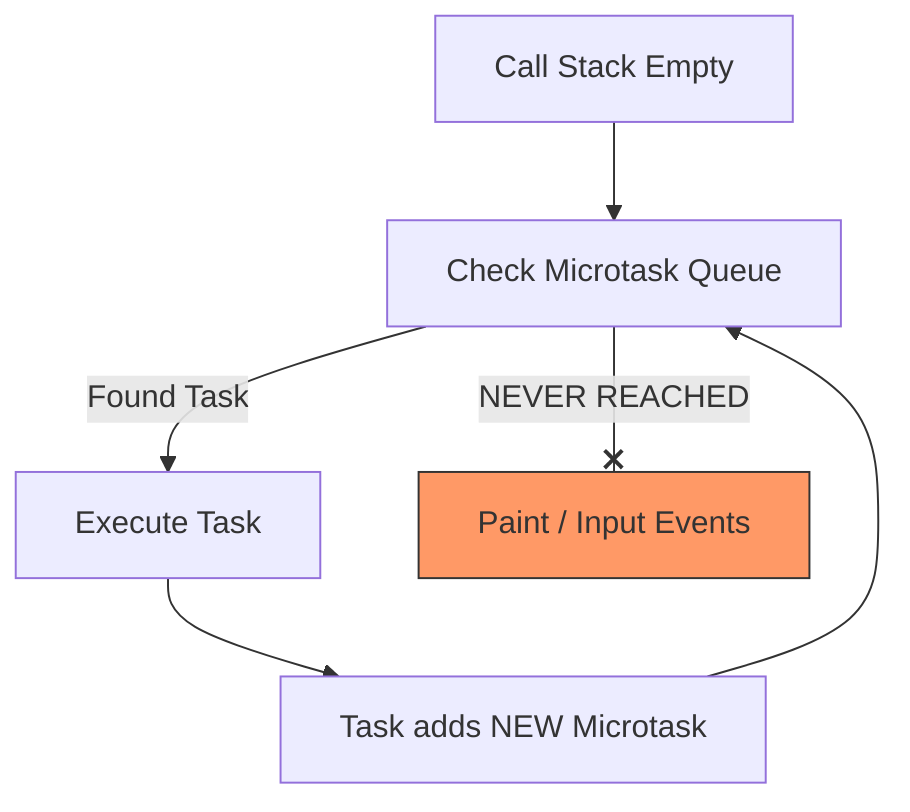

import Tabs from '@theme/Tabs';
import TabItem from '@theme/TabItem';

# Task Starvation

**Task Starvation** occurs when the browser's main thread is so overwhelmed by high-priority tasks (usually microtasks) that it never gets the chance to handle lower-priority work, such as processing user clicks, keyboard input, or rendering the screen.

:::info[Core Philosophy]
**Priority Exhaustion**. In the Event Loop's hierarchy, certain tasks are "VIPs". If the VIPs never leave the room, the standard tasks (the users) are left "starving" outside, leading to a completely frozen interface.
:::

---

## 1. Easy: The Frozen Tab

Have you ever clicked a button on a website and nothing happened for 3 seconds, even though the mouse cursor wasn't a "beachball"? That is usually **Task Starvation**.

In JavaScript, if you run a heavy loop:
```javascript
while(true) {
  // Do nothing
}
```
The "Call Stack" never becomes empty. Because the Event Loop only checks for clicks/paints when the stack is empty, the browser is essentially dead.

---

## 2. Medium: Microtask Recursion

The most common "invisible" way to cause starvation is through recursive **Microtasks** (Promises). 

Because the Event Loop **must** drain the Microtask queue until it's empty before it can paint or handle clicks, a function that keeps adding to the Microtask queue will block everything else indefinitely.



---

## 3. Hard: Intentional Yielding

To prevent starvation during heavy background work (like processing a massive Excel file in the browser), you must **Yield** to the main thread. 

Yielding means telling the browser: "I'll take a break, go handle the user's clicks, and then call me back."

<Tabs groupId="lang" queryString>
<TabItem value="js" label="JavaScript">

```javascript
async function processMassiveData(items) {
  for (let i = 0; i < items.length; i++) {
    doHeavyMath(items[i]);
    
    // Every 100 items, we yield to the browser
    if (i % 100 === 0) {
      await new Promise(resolve => setTimeout(resolve, 0));
    }
  }
}
```

</TabItem>
<TabItem value="ts" label="TypeScript">

```typescript
function yieldToMain(): Promise<void> {
  // Using Task (Macrotask) priority to allow painting in between
  return new Promise(resolve => setTimeout(resolve, 0));
}

async function heavyTask(data: any[]) {
  for (const item of data) {
    process(item);
    if (shouldYield()) await yieldToMain();
  }
}
```

</TabItem>
</Tabs>

---

## 4. Advanced: `isInputPending` and the Scheduler API

Modern browsers (Chrome 87+) introduced the `navigator.scheduling.isInputPending()` API. This allows you to check if there are pending user events *without* actually yielding if the user is idle.

Additionally, the **Prioritized Task Scheduling API** (`scheduler.postTask`) allows you to explicitly mark tasks as `background`, `user-visible`, or `user-blocking`.

```javascript
// Advanced Yielding Logic
async function smartProcess(items) {
  for (const item of items) {
    process(item);
    
    // Only yield if there's an actual click or keypress waiting!
    if (navigator.scheduling?.isInputPending()) {
      await scheduler.yield(); // Optimal yield
    }
  }
}
```

---

## 5. Interview Prep: 4 Key Questions

### Q1: What is the primary difference between starvation caused by a `while` loop vs. a Promise loop?
**A:** A `while` loop blocks the current **Call Stack**. A recursive Promise loop clears the stack but keeps the **Microtask Queue** perpetually full. Both result in a frozen UI, but the Promise loop is often harder to debug because the stack trace appears "empty" to some performance profilers.

### Q2: How does React Concurrent Mode prevent Task Starvation?
**A:** React Fiber uses a custom scheduler that tracks a **5ms time-slice**. After working for 5ms, React checks a sub-millisecond timer. If the time is up, React yields control using `MessageChannel` (a macrotask logic), allowing the browser to handle input/painting before React resumes from its last Fiber node.

### Q3: Why is `setTimeout(fn, 0)` used over `Promise.resolve().then(fn)` to prevent starvation?
**A:** Because `setTimeout` is a **Macrotask**. The browser is allowed to render and process inputs *between* Macrotasks. In contrast, the browser *must* finish all Microtasks before it is allowed to do anything else.

### Q4: Explain "The Uncanny Valley" of yielding.
**A:** If you yield too frequently (e.g., every single item), the overhead of scheduling and context switching makes the total task time significantly longer. If you yield too infrequently, the UI stutters. The "sweet spot" is typically yielding every 5-10ms of pure computation time.
