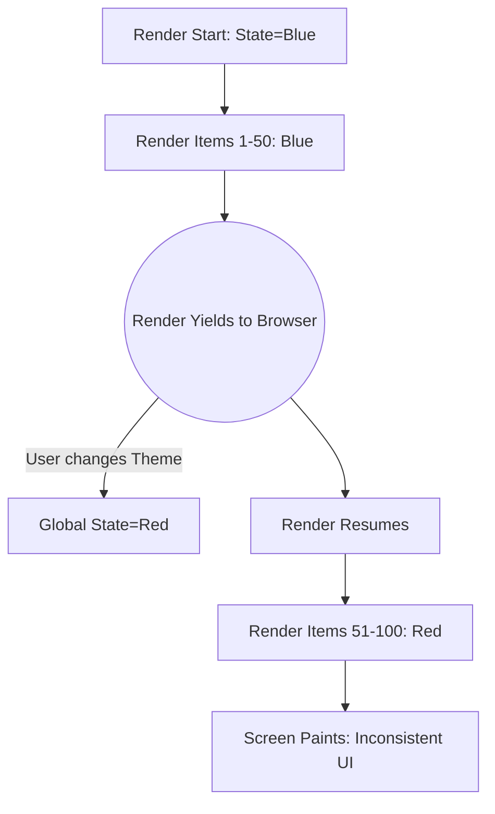

import Tabs from '@theme/Tabs';
import TabItem from '@theme/TabItem';

# Tearing in Concurrent UI

**Tearing** in a user interface occurs when a single visual frame displays inconsistent data. In modern web frameworks featuring "Concurrent Rendering" (like React 18), the framework can pause rendering a component tree to handle high-priority user input. If global state changes during that pause, the UI can "tear," showing part of the screen with old data and part with new data.

:::info[Core Philosophy]
**The Cost of Yielding**. When a renderer yields control back to the browser to maintain 60FPS, it leaves a window of time where external state (like a Redux store or Window dimensions) can mutate. When the render resumes, the truth has changed.
:::

---

## 1. Easy: The Concept of Tearing

Imagine a long list of items where every item displays the current theme color (e.g., "Blue").

1.  React starts rendering the list. Items 1-50 are rendered in "Blue".
2.  React pauses rendering because the user clicked a button to change the theme to "Red".
3.  The global state updates to "Red".
4.  React resumes rendering Items 51-100. Because it checks the global state again, it renders them in "Red".
5.  **The Tear**: The single screen shows half the list in Blue and half in Red.



---

## 2. Medium: Internal vs. External State

-   **Internal State (`useState`, `useReducer`)**: React completely controls this state. It handles concurrency perfectly by keeping multiple versions of the state in memory. Tearing **cannot** happen with purely internal React state.
-   **External State (Redux, Zustand, Window APIs)**: This state lives outside React. React has no control over when it mutates. If React reads from it at different times during a concurrent render, tearing occurs.

---

## 3. Hard: Implementation and `useSyncExternalStore`

To solve this in React 18, the core team introduced a specific hook designed to safely read from external data sources during concurrent rendering: `useSyncExternalStore`.

<Tabs groupId="lang" queryString>
<TabItem value="js" label="JavaScript">

```javascript
// A vulnerable pattern (Can Tear)
// Reading directly from window width during a concurrent transition.
function ResponsiveComponent() {
  const [width, setWidth] = useState(window.innerWidth);
  
  useEffect(() => {
    const handleResize = () => setWidth(window.innerWidth);
    window.addEventListener('resize', handleResize);
    return () => window.removeEventListener('resize', handleResize);
  }, []);

  return <div>{width > 800 ? "Desktop" : "Mobile"}</div>;
}
```

</TabItem>
<TabItem value="ts" label="TypeScript">

```typescript
import { useSyncExternalStore } from 'react';

// The safe pattern (Tear-Free)
// This forces React to read a consistent snapshot of the data.
function useWindowWidth() {
  return useSyncExternalStore(
    // 1. How to subscribe to changes
    (callback) => {
      window.addEventListener('resize', callback);
      return () => window.removeEventListener('resize', callback);
    },
    // 2. How to get the current snapshot
    () => window.innerWidth
  );
}

function ResponsiveComponent() {
  const width = useWindowWidth();
  return <div>{width > 800 ? "Desktop" : "Mobile"}</div>;
}
```

</TabItem>
</Tabs>

---

## 4. Advanced: How `useSyncExternalStore` Prevents Tearing

How does the new hook actually fix the problem? By falling back to **Synchronous Rendering**.

If `useSyncExternalStore` detects that the external store has changed *while* a concurrent render is in progress, it immediately throws away the current incomplete render pass. It then forces a brand new, **synchronous** render pass to ensure that all components on the screen read the exact same, fresh snapshot of the data at the same time.

It trades a small amount of performance (falling back to synchronous blocking rendering) in exchange for guaranteed visual consistency.

---

## 5. Interview Prep: 4 Key Questions

### Q1: In gaming and graphics, what causes "Screen Tearing"?
**A:** Screen tearing in graphics happens when the video card sends a new frame to the monitor while the monitor is still halfway through drawing the previous frame. You physically see the top half of Frame A and the bottom half of Frame B. UI Tearing in web frameworks is the exact same concept, but mapped to DOM nodes instead of pixels.

### Q2: Why didn't tearing happen in React 17 and earlier?
**A:** React 17 and earlier only supported **Synchronous Rendering**. Once a render started, it could not be interrupted. It blocked the main thread until the entire component tree was rendered. Because it never paused, external state could never change mid-render, making tearing impossible.

### Q3: If I use `useState` exclusively, do I need to worry about tearing?
**A:** No. Tearing only occurs when a concurrent framework reads from **mutable sources it does not control**. Because React tightly manages `useState`, it knows how to isolate state updates to specific render passes (branching), guaranteeing consistency.

### Q4: Why is `useEffect` not a solution for tearing?
**A:** `useEffect` runs **after** the browser has painted the screen. If a tear happens during the render phase, the inconsistent UI will be flushed to the screen. The user will see the glitch. Even if the `useEffect` catches the state change and queues a new render, the damage is already done—the user saw the visual tear.
