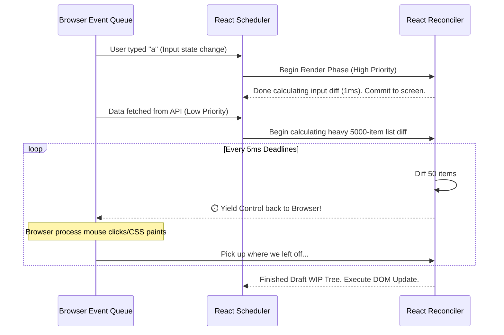

import Tabs from '@theme/Tabs';
import TabItem from '@theme/TabItem';

# Time Slicing

Time Slicing is the low-level scheduling mechanism introduced within React's Concurrent Mode (React 18) that completely eliminates the concept of single, massive, UI-blocking render cycles. 

:::info[Core Philosophy]
**Cooperative Multitasking.** JavaScript executes strictly on a single thread alongside layout paints and user events. Any JS code that runs uninterrupted for longer than `16ms` drops the browser’s frame rate below 60fps. Time Slicing solves this by having React explicitly yield control back to the browser every `5ms`.
:::

---

## 1. Easy: The Main Thread Bottleneck

Before Time Slicing, if React needed to render 10,000 `<TableRow />` child components, the Virtual DOM mapping would lock the entire main thread for up to `300ms`. 

If the user tried to type in a search box nicely during those 300ms, the input would physically freeze. The characters would not appear on screen because the browser's painting engine was queued *behind* React's massive calculation block. This heavily degraded perceived performance and made apps feel "clunky".

---

## 2. Medium: How React Yields Control

In the Time Slicing paradigm, React checks an internal stopwatch every time it processes exactly one element in the Fiber Tree. If `5ms` has passed, React safely pauses itself.



By turning the monolithic calculation into 5ms chunks, the user's keystrokes are processed smoothly inside the gaps.

---

## 3. Hard: Low-Level Implementation (MessageChannel)

Modern JS provides APIs to request idle time (`requestIdleCallback`), but React explicitly abandoned it because it isn't aggressive enough. For example, Apple's Safari caps `requestIdleCallback` to a sluggish 30fps.

React implemented its own precise scheduler utilizing the `MessageChannel` Web API to force incredibly tight micro-task delays that yield exactly when React wants to.

<Tabs groupId="lang" queryString>
<TabItem value="js" label="JavaScript">

```javascript
const channel = new MessageChannel();
const port = channel.port2;
let isMessageLoopRunning = false;

// When the port receives a message, React does a chunk of work.
channel.port1.onmessage = function performWorkUntilDeadline() {
  const currentTime = performance.now();
  const deadline = currentTime + 5; // React's classic 5ms slice allowance
  
  while (performance.now() < deadline) {
    // Traverse Fiber Linked List and do reconciliation math
    const hasMoreWork = reconcileNextFiberNode();
    
    if (!hasMoreWork) {
      isMessageLoopRunning = false;
      return; // Tree is completely diffed! Time to commit.
    }
  }
  
  // 5ms passed. The loop broke. We send another message to ourselves.
  // This physically yields control to the Browser, letting it paint input before running again!
  port.postMessage(null);
};

function scheduleConcurrentWork() {
  if (!isMessageLoopRunning) {
    isMessageLoopRunning = true;
    port.postMessage(null); 
  }
}
```

</TabItem>
<TabItem value="ts" label="TypeScript">

```typescript
const channel: MessageChannel = new MessageChannel();
const port: MessagePort = channel.port2;
let isMessageLoopRunning: boolean = false;

channel.port1.onmessage = function performWorkUntilDeadline(): void {
  const currentTime: number = performance.now();
  const deadline: number = currentTime + 5; 
  
  while (performance.now() < deadline) {
    const hasMoreWork: boolean = reconcileNextFiberNode();
    
    if (!hasMoreWork) {
      isMessageLoopRunning = false;
      return; 
    }
  }
  
  port.postMessage(null);
};

function scheduleConcurrentWork(): void {
  if (!isMessageLoopRunning) {
    isMessageLoopRunning = true;
    port.postMessage(null); 
  }
}
```

</TabItem>
</Tabs>

---

## 4. Advanced: The Replay and Bailout Mechanics

What happens if React yields control during Time Slicing, and the user triggers an entirely new update that completely invalidates the work React was just doing?

For example:
1. User searches `"React"`.
2. React starts Time Slicing the massive array of results for `"React"`.
3. 2ms in, the user types `" Framework"`. The query is now `"React Framework"`.

In this scenario, React's scheduler is mathematically smart enough to conceptually "**trash**" the Work-In-Progress tree it was half-calculating. It intentionally abandons the sliced mathematical work for `"React"`, instantly absorbs the `"React Framework"` query into the highest priority slot, and begins a brand new background Time Sliced render from top to bottom.

---

## 5. Interview Prep: 4 Key Questions

### Q1: Can a user see a "half-rendered" component during Time Slicing?
**A:** No. Time Slicing exclusively interrupts the *Render Phase* (the mathematical Diffing of the Virtual DOM). The *Commit Phase* (which physically alters the DOM on the user's screen) is completely uninterruptible. React calculates the diff in chunks in memory, but commits the unified result strictly simultaneously.

### Q2: Why does React use `MessageChannel` for its scheduling polyfill instead of `setTimeout(0)`?
**A:** `setTimeout(0)` seems like it yields to the browser instantly, but the HTML5 spec actually clamps nested `setTimeout` calls to a minimum of ~`4ms` after a few iterations. This completely destroys React's frame budgeting. `MessageChannel` bypasses this minimum clamping, allowing high-frequency, sub-millisecond yielding loops.

### Q3: When should a developer completely avoid using Time Slicing triggers (`startTransition`)?
**A:** Never use `startTransition` for visually controlled inputs (e.g., standard text box keystrokes). Your text inputs must always receive strictly synchronous state tracking, or the user's cursor will skip, jump, and glitch wildly. Put the heavy derived-state list rendering in the transition, but keep the raw input text state completely synchronous.

### Q4: How is Time Slicing conceptually functionally different from Web Workers?
**A:** Both attempt to solve Main Thread blocking. Web Workers legitimately run code on a separate OS thread, natively allowing heavy background math without blocking the DOM UI. Time Slicing is an illusion—it still runs purely on the main thread but achieves "parallel-like" responsiveness through extremely aggressive, surgical pausing.
