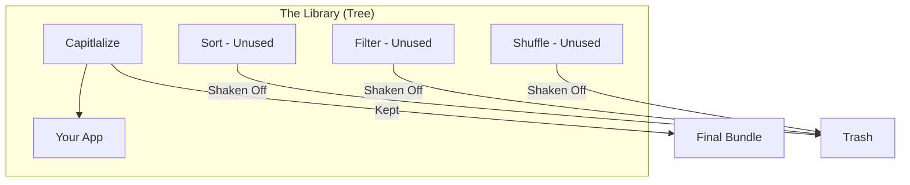

import Tabs from '@theme/Tabs';
import TabItem from '@theme/TabItem';

# Tree Shaking Internals

**Tree Shaking** is a form of dead code elimination. It ensures that only the code that is actually "used" across your application makes it into the final JavaScript bundle, while unused components, functions, and variables are "shaken off" the tree.

:::info[Core Philosophy]
**Static vs Dynamic**. Tree shaking relies on the **Static** nature of ES Modules (`import`/`export`). Unlike CommonJS (`require`), the structure of ES Modules is determined during the build process, allowing bundlers to calculate the exact usage-graph before the code ever runs.
:::

---

## 1. Easy: The Library Problem

Imagine you import a massive utility library like `lodash` just to use a single `capitalize` function. Without tree shaking, your user would download the **entire** 500KB library. 

With tree shaking, the bundler "scans" your code, sees that you only called `capitalize`, and completely ignores the other 200 functions in the library, keeping your bundle tiny.



---

## 2. Medium: ESM vs. CommonJS

Tree Shaking **requires** ES Modules. 

- **CommonJS (`require`)**: Is dynamic. You can `require` a file inside an `if` statement or a loop. The bundler cannot know if that code will actually run until it executes.
- **ES Modules (`import`)**: Is static. `import` statements must be at the top level and cannot be inside conditionals. This allows the bundler to build the dependency tree mathematically without running the code.

<Tabs groupId="lang" queryString>
<TabItem value="js" label="JavaScript">

```javascript
// ❌ CommonJS (Hard to Tree Shake)
const utils = require('./utils');
if (Math.random() > 0.5) {
  utils.helper();
}

// ✅ ES Modules (Tree Shakeable)
import { helper } from './utils';
helper();
```

</TabItem>
<TabItem value="ts" label="TypeScript">

```typescript
// utils.ts
export const usedFn = () => "I am kept";
export const unusedFn = () => "I am deleted";

// main.ts
import { usedFn } from './utils';
console.log(usedFn()); 

// During build, 'unusedFn' is physically removed from the output.
```

</TabItem>
</Tabs>

---

## 3. Hard: The `sideEffects` Property

The biggest enemy of tree shaking is a **Side Effect**. A side effect happens when a module changes something *outside* of itself just by being imported (e.g., adding a global polyfill or modifying a `window` property).

Bundlers are scared to delete code that might have side effects. To help them, you can mark your library as side-effect-free in `package.json`:

```json
{
  "name": "my-library",
  "sideEffects": false
}
```
If `sideEffects` is `false`, the bundler is given "legal permission" to delete any export that isn't explicitly used, even if it might contain internal logic.

---

## 4. Advanced: The Marking Process

Internally, bundlers like Webpack perform tree shaking in two steps:
1.  **Marking**: During the initial "Module Graph" build, Webpack marks every export as "used" or "provided".
2.  **Pruning**: A minifier (like Terser or esbuild) then checks these marks. If a function is marked as "provided" but not "used," the minifier physically deletes the code from the final `.js` file.

**A Note on "Top Level Execution"**: Even if you don't use an export, if that module has code at the top level (e.g., `console.log("init")`), that code will **often stay** in the bundle because the bundler cannot prove it is safe to remove without breaking the app's initialization logic.

---

## 5. Interview Prep: 4 Key Questions

### Q1: Why does Tree Shaking work with `import` but not `require`?
**A:** Because `import` is **static**. ES Modules must be declared at the top level, meaning the dependency graph is fixed and can be analyzed by the bundler without executing any JavaScript. `require` is **dynamic**, as it can be called inside functions and conditionals, making it impossible to know which modules are truly "dead" before runtime.

### Q2: What is the purpose of the `sideEffects` flag in `package.json`?
**A:** It tells the bundler whether the modules in your project have side effects (like modifying global variables or adding CSS). If set to `false`, the bundler can safely skip entire files that contain unused exports, even if they have code that runs during the import phase.

### Q3: Why might an unused function still appear in your production bundle?
**A:** Usually due to **Side Effect Detection**. If the bundler sees that the function is part of a module that performs top-level execution (like `window.x = 1`), it may fear that removing any part of that file will break the necessary global modification. It can also happen if the function is referenced by another function that *is* used.

### Q4: How do you optimize a library like `lodash` for tree shaking?
**A:** Use the ESM version (`lodash-es`). Standard `lodash` is built with CommonJS, which bundlers struggle to analyze. Alternatively, you can import specific sub-paths (e.g., `import capitalize from 'lodash/capitalize'`) to ensure only that specific file is included in the bundle.
