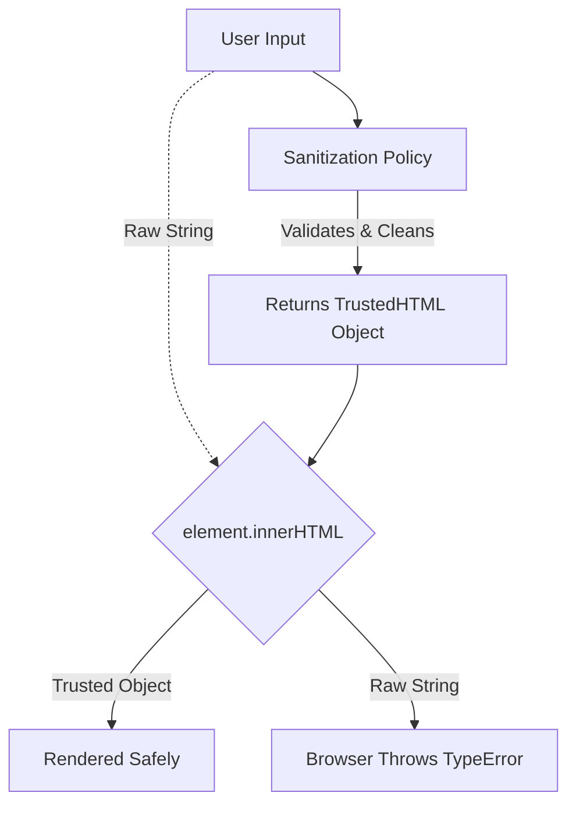

import Tabs from '@theme/Tabs';
import TabItem from '@theme/TabItem';

# Trusted Types

**Trusted Types** is a browser security API designed to eliminate **DOM-based Cross-Site Scripting (DOM XSS)**. It does this by fundamentally changing how the browser processes dangerous DOM APIs, requiring developers to explicitly sanitize data before injecting it.

:::info[Core Philosophy]
**Types over Strings**. For decades, `innerHTML` accepted plain strings. This made it trivially easy to accidentally inject malicious markup. Trusted Types forces the browser to reject plain strings, requiring a special `TrustedHTML` object instead.
:::

---

## 1. Easy: The Concept of Sinks

A **Sink** is a JavaScript function or DOM property that can execute code or render HTML if given malicious input.
-   `element.innerHTML` (HTML Sink)
-   `eval()` (Execution Sink)
-   `script.src` (URL Sink)

By default, these sinks accept strings. If a Trusted Types policy is enforced, they **will crash the application** if passed a plain string.



---

## 2. Medium: Enforcing the Policy

Trusted Types is enforced via the `Content-Security-Policy` header:

`Content-Security-Policy: require-trusted-types-for 'script';`

Once this header is set, every dangerous sink in the application is locked down immediately. If your legacy code does `element.innerHTML = "<b>Hello</b>"`, the browser throws a `TypeError`.

---

## 3. Hard: Implementation and Policies

To bypass the lockdown safely, you must define a **Trusted Type Policy** that dictates exactly how strings are converted into Trusted Objects.

<Tabs groupId="lang" queryString>
<TabItem value="js" label="JavaScript">

```javascript
// 1. Define a Policy
// This tells the browser how we intend to sanitize HTML.
const sanitizerPolicy = trustedTypes.createPolicy('default', {
  createHTML: (stringInput) => {
    // In reality, use a real sanitizer like DOMPurify here
    return stringInput.replace(/</g, '&lt;'); 
  }
});

const myDiv = document.getElementById('content');

// 2. This will THROW an error (Blocked by CSP)
myDiv.innerHTML = "<h1>Hello</h1>"; 

// 3. This will SUCCEED
// We pass the string through the policy to get a TrustedHTML object
const safeHtml = sanitizerPolicy.createHTML("<h1>Hello</h1>");
myDiv.innerHTML = safeHtml;
```

</TabItem>
<TabItem value="ts" label="TypeScript">

```typescript
// The 'default' policy magic
// If you name a policy 'default', the browser will automatically 
// run all plain strings through it before throwing an error.

trustedTypes.createPolicy('default', {
  createHTML: (string) => DOMPurify.sanitize(string, {RETURN_TRUSTED_TYPE: true})
});

// Because a 'default' policy exists, this legacy code now works again!
// The browser implicitly calls defaultPolicy.createHTML("...")
element.innerHTML = userProvidedString; 
```

</TabItem>
</Tabs>

---

## 4. Advanced: Trusted Types in Frameworks

Modern frameworks like React and Angular have already adopted Trusted Types internally.
-   **React**: React's `dangerouslySetInnerHTML` supports passing `TrustedHTML` objects instead of plain strings.
-   **Angular**: Angular's internal rendering engine natively generates Trusted Types, meaning Angular apps can turn on the `require-trusted-types-for` CSP header with almost zero code changes.

---

## 5. Interview Prep: 4 Key Questions

### Q1: What is the difference between Reflected XSS and DOM-based XSS?
**A:** Reflected XSS happens when a server takes malicious input and reflects it back in the HTTP response HTML. DOM-based XSS happens entirely on the client-side; the server never sees the payload. The malicious payload is read from the DOM (like `window.location.hash`) and injected directly into a sink (like `innerHTML`) by client-side JavaScript. Trusted Types specifically targets DOM-based XSS.

### Q2: If I use React, do I need to worry about `innerHTML` sinks?
**A:** React generally protects you from XSS by automatically encoding strings rendered via `{curly_braces}`. However, if you explicitly use the `dangerouslySetInnerHTML` prop, or if you access the DOM directly via a `ref` and set `ref.current.innerHTML`, you are bypassing React's protections and creating a dangerous sink.

### Q3: Why is `setTimeout` considered an Execution Sink?
**A:** Historically, `setTimeout` and `setInterval` accepted strings as their first argument, which they would pass to the JavaScript engine to be evaluated (just like `eval()`). e.g., `setTimeout("alert(1)", 1000)`. Trusted Types blocks this behavior, requiring functions to be passed instead.

### Q4: What is DOMPurify, and how does it relate to Trusted Types?
**A:** DOMPurify is a popular library used to strip malicious code (like `<script>` tags) out of HTML strings. It integrates perfectly with Trusted Types. Instead of writing your own regex in a policy (which is dangerous and error-prone), you use DOMPurify inside your `createPolicy` function to do the heavy lifting of sanitization, and then return the result as a `TrustedHTML` object.
