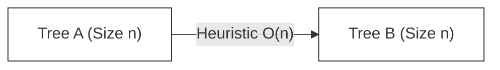

import Tabs from '@theme/Tabs';
import TabItem from '@theme/TabItem';

# Virtual DOM Diffing Complexity

Creating a robust UI library relies on an efficient way to calculate the difference between two states of the Virtual DOM. This calculation is the heart of **Reconciliation**.

:::info[Core Philosophy]
**Heuristic O(n) Optimization**. Finding the minimum transformation between two arbitrary trees (Tree Edit Distance) is mathematically expensive. React accepts specific "constraints" on web UI structure to shortcut this math from cubic to linear time.
:::

---

## 1. Easy: The Problem of Tree Comparison

In computer science, comparing two trees to find the minimum number of changes (insert, delete, move) is a solved problem called **Tree Edit Distance**. 

However, the state-of-the-art algorithms for this have a complexity of **$O(n^3)$**.

**Why is this a failure for the Web?**
If your page has 1,000 elements (standard for a dashboard):
- $1,000^3$ = **1,000,000,000** (1 Billion) calculations.
- Browsers need to render at 60fps, meaning we only have **16.6ms** per frame.
- A mobile CPU cannot execute 1 billion comparisons in 16ms. The UI would freeze instantly.

---

## 2. Medium: React's $O(n)$ Heuristics

To make the web fast, React makes two bold assumptions that reduce the complexity from $O(n^3)$ to **$O(n)$** (Linear Time):

1.  **Different Types = Different Trees**: If a `<div>` is replaced by a `<span>`, React won't check the children. It tears down the old tree and builds a new one.
2.  **Keys for Stability**: The developer provides a `key` prop to hint which elements are stable across renders.



---

## 3. Hard: Implementation Logic

React compares nodes level-by-level (Breadth-First style conceptually). It doesn't try to match a node that moved from the header to the footer; it only compares siblings at the same depth.

<Tabs groupId="lang" queryString>
<TabItem value="js" label="JavaScript">

```javascript
// Pseudo-code for Heuristic Diff
function diff(oldNode, newNode) {
  // 1. Different Types? Replace the whole subtree
  if (oldNode.type !== newNode.type) {
    return { type: 'REPLACEMENT', node: newNode };
  }

  // 2. Same Type? Update attributes in-place
  const patch = diffAttributes(oldNode.props, newNode.props);

  // 3. Recurse on Children (The O(n) part)
  // We match children by index or key, never searching the whole tree
  const childPatches = diffChildren(oldNode.children, newNode.children);

  return { type: 'UPDATE', patch, childPatches };
}
```

</TabItem>
<TabItem value="ts" label="TypeScript">

```typescript
type NodeType = string | React.ComponentType;

interface VirtualNode {
  type: NodeType;
  props: Record<string, any>;
  children: VirtualNode[];
}

function reconcile(oldNode: VirtualNode, newNode: VirtualNode): Patch {
  if (oldNode.type !== newNode.type) {
    return { action: 'REPLACE', value: newNode };
  }

  // Linear traversal of props and children
  const attrDiff = reconcileProps(oldNode.props, newNode.props);
  const childrenDiff = reconcileChildren(oldNode.children, newNode.children);

  return { action: 'UPDATE', attrDiff, childrenDiff };
}
```

</TabItem>
</Tabs>

---

## 4. Advanced: Why $O(n^3)$ is the "True" Complexity

The reason general tree diffing is $O(n^3)$ is that a node could technically move anywhere. A `<span>` could move from being a child of the `<body>` to being a nested child of a `<footer>`. 

Finding the absolute minimum set of operations to account for **cross-level moves** requires comparing every node in Tree A against every node in Tree B, plus internal path calculations. React intentionally ignores cross-level moves to maintain performance, assuming that in UIs, components usually stay within their parent's context.

---

## 5. Interview Prep: 4 Key Questions

### Q1: Why did React choose $O(n)$ over a more accurate $O(n^3)$ algorithm?
**A:** Because of the "16ms Frame Budget". Web performance requires near-instant calculations. A linear $O(n)$ algorithm scales perfectly with large UIs (10k nodes = 10k checks), whereas a cubic $O(n^3)$ algorithm would crash the browser on even moderately sized trees (100 nodes = 1 million checks).

### Q2: How does the `key` prop specifically lower the complexity from $O(n^2)$ to $O(n)$ in lists?
**A:** Without keys, React compares children by index. If you shift a list, every comparison fails, leading to quadratic-like re-renders. With keys, React uses a **Map** to look up nodes by key in **$O(1)$** time, allowing a single linear pass to identify moves, additions, and deletions.

### Q3: What is the "Type Stability" assumption?
**A:** It is the assumption that components of the same type will produce similar trees and components of different types won't. This allows React to skip deep-diffing entirely if the root tag changes (e.g., `div` to `section`), which is a massive performance shortcut.

### Q4: Does React use DFS or BFS for Reconciliation?
**A:** React traverses the Fiber tree using **Depth-First Search (DFS)** (child -> sibling -> parent). However, for the specific task of *diffing* children of a single node, it conceptually applies a level-by-level (BFS-like) logic to ensure it doesn't get lost in cross-level comparisons.
