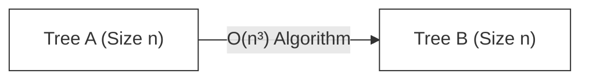
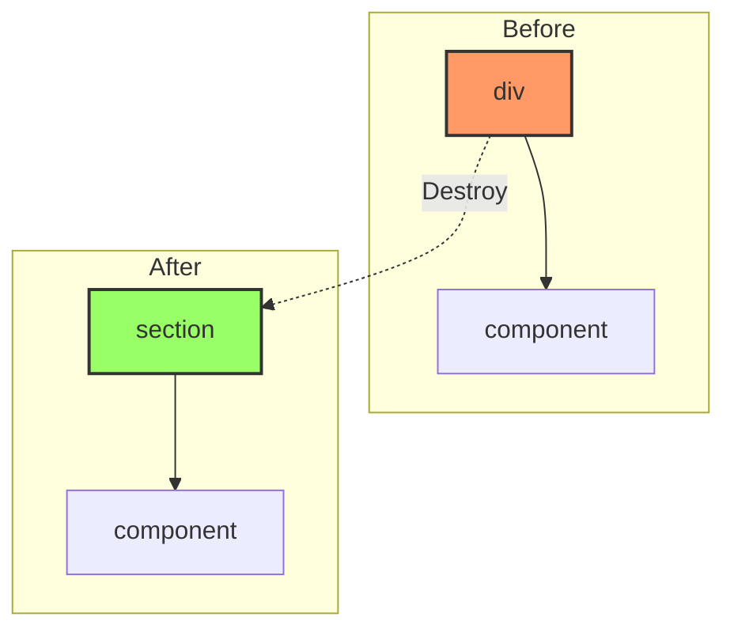

import Tabs from '@theme/Tabs';
import TabItem from '@theme/TabItem';

# Virtual DOM Diffing Complexity

Creating a robust UI library relies on an efficient way to calculate the difference between two states of the Virtual DOM. This calculation is the heart of **Reconciliation**.

:::info[Core Philosophy]
**Heuristic O(n) Optimization**. Theoretically, finding the minimum transformation between two trees (Tree Edit Distance) is a solved problem but is computationally explosive. React accepts some "constraints" on how web apps are built to shortcut this math.
:::

---

## 1. The $O(n^3)$ Dilemma

In pure computer science, the problem of transforming one tree into another is known as **Tree Edit Distance**. The state-of-the-art algorithms (like the Zhang-Shasha algorithm) have a complexity of **$O(n^2)$** or **$O(n^3)$** depending on the degree of optimization.



**Why is this a failure for the Web?**
If a page has 1,000 elements (a standard complex dashboard):
- $1,000^3$ = **1,000,000,000** calculations.
- At 60 frames per second, we have roughly **16.6ms** per frame.
- A CPU cannot execute 1 billion complex object comparisons in 16ms.

---

## 2. React’s Heuristic Solution

React implements a heuristic algorithm with **$O(n)$** complexity based on two assumptions:

1. **Two elements of different types will produce different trees.**
2. **The developer can hint at child stability with a `key` prop.**

### Assumption 1: Element Type Stability
If React sees a `<div>` change to a `<span>`, it doesn't bother checking the children. It assumes everything below is different. It unmounts the old tree and mounts the new one.



### Assumption 2: The Key Prop
Keys allow React to "trace" which elements moved. Without keys, if you insert at the top of a list, React thinks *every* item changed because the index shifted.

---

## 3. Implementation Logic

React compares nodes level-by-level (Breadth-First Search style conceptually for the diffing layer).

<Tabs groupId="lang" queryString>
<TabItem value="js" label="JavaScript">

```javascript
// Pseudo-code for Heuristic Diff
function diff(oldNode, newNode) {
  // 1. Different Types? Replace the whole thing
  if (oldNode.type !== newNode.type) {
    return { type: 'REPLACEMENT', node: newNode };
  }

  // 2. Same Type? Update attributes
  const patch = diffAttributes(oldNode.props, newNode.props);

  // 3. Recurse on Children (The O(n) part)
  // Instead of all-to-all matching, we match by index/key
  const childPatches = diffChildren(oldNode.children, newNode.children);

  return { type: 'UPDATE', patch, childPatches };
}
```

</TabItem>
<TabItem value="ts" label="TypeScript">

```typescript
type NodeType = string | ComponentType;
interface VirtualNode {
  type: NodeType;
  props: Record<string, any>;
  children: VirtualNode[];
}

function diff(oldNode: VirtualNode, newNode: VirtualNode): Patch {
  if (oldNode.type !== newNode.type) {
    return { action: 'REPLACE', value: newNode };
  }

  const attrDiff = reconcileProps(oldNode.props, newNode.props);
  const childrenDiff = reconcileChildren(oldNode.children, newNode.children);

  return { action: 'UPDATE', attrDiff, childrenDiff };
}
```

</TabItem>
</Tabs>

---

## 4. Interview Prep: 4 Key Questions

### Q1: Why is $O(n^3)$ used for general tree diffing?
**A:** Because it accounts for nodes moving across different levels of the tree. A node could move from the root to being a child of a distant leaf. Finding the *absolute* minimum set of operations (insert, delete, move) for any arbitrary tree requires cubic time. React ignores "moves across levels" because they are extremely rare in UIs.

### Q2: How does the `key` prop specifically lower complexity?
**A:** Without keys, React performs a simple pairwise comparison by index ($O(n)$). If you insert at the start, every subsequent comparison fails. With keys, React uses a **Map** to look up nodes by key in $O(1)$ average time, allowing it to realize nodes just shifted, maintaining a linear $O(n)$ traversal.

### Q3: What happens to a component's state when its parent changes from `<div>` to `<section>`?
**A:** The state is **destroyed**. React performs a full unmount. Even if the component itself didn't change, the fact that its parent changed type signals to React that the entire subtree is invalid and needs to be rebuilt.

### Q4: Does React use a Depth-First or Breadth-First search for diffing?
**A:** React traverses the Fiber tree using a **Depth-First Search (DFS)** style (child first, then sibling, then return). However, for the *diffing logic* of children of a single node, it conceptually treats it as a level-by-level comparison to maintain $O(n)$ efficiency.
