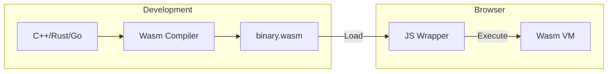

import Tabs from '@theme/Tabs';
import TabItem from '@theme/TabItem';

# WebAssembly Integration

**WebAssembly (Wasm)** is a binary instruction format for a stack-based virtual machine. It is designed as a portable compilation target for programming languages like C, C++, and Rust, enabling high-performance applications on the web.

:::info[Core Philosophy]
**Near-Native Performance**. WebAssembly is not a replacement for JavaScript; it is a companion. It allows browsers to execute computationally intense logic (like video editing, 3D gaming, or cryptography) at speeds that JavaScript cannot achieve.
:::

---

## 1. Easy: What is Wasm?

JavaScript is a high-level, dynamically typed language that must be parsed, compiled, and optimized by the browser's engine (like V8). 
**WebAssembly** is a low-level, binary format that is already "pre-compiled." The browser can decode and execute Wasm much faster than it can parse JavaScript.



---

## 2. Medium: Loading and Running

You can't just link a `.wasm` file in a `<script>` tag. You must fetch the binary, compile it, and instantiate it using the JavaScript **WebAssembly API**.

---

## 3. Hard: JS/Wasm Interoperability

The most critical part of Wasm integration is the **"Sanwich Architecture"**: JavaScript handles the DOM and UI, while Wasm handles the heavy math. They share data through **WebAssembly Linear Memory**.

<Tabs groupId="lang" queryString>
<TabItem value="js" label="JavaScript">

```javascript
// main.js - The modern way to load Wasm
async function loadWasm() {
  // instantiateStreaming is the most efficient method
  const { instance } = await WebAssembly.instantiateStreaming(
    fetch('math.wasm'),
    { 
      // Import object for Wasm to call JS functions
      env: { 
        logger: (val) => console.log("Wasm says:", val) 
      } 
    }
  );

  // Calling a Wasm function
  console.log(instance.exports.add(5, 10));
}

loadWasm();
```

</TabItem>
<TabItem value="ts" label="TypeScript">

```typescript
// Define the interface for our Wasm exports
interface WasmExports {
  add(a: number, b: number): number;
  memory: WebAssembly.Memory;
}

const initializeWasm = async (url: string): Promise<WasmExports> => {
  const response = await fetch(url);
  const buffer = await response.arrayBuffer();
  
  // Compiling and instantiating
  const module = await WebAssembly.instantiate(buffer);
  return module.instance.exports as unknown as WasmExports;
};

// Accessing shared memory from TS
const wasm = await initializeWasm("logic.wasm");
const sharedArray = new Uint8Array(wasm.memory.buffer);
```

</TabItem>
</Tabs>

---

## 4. Advanced: Linear Memory and Buffers

Wasm can only "talk" in numbers (integers and floats). To pass a string or an image from JS to Wasm:
1.  **Allocate**: Wasm creates a block of `WebAssembly.Memory`.
2.  **Write**: JS writes the string data into that memory as a `Uint8Array`.
3.  **Pointer**: JS passes the *index* (pointer) of that data to the Wasm function.
4.  **Read**: Wasm reads the data from that index in its memory.

**Performance Warning**: Crossing the "JS-Wasm bridge" frequently is expensive. It is better to send a large batch of data once, let Wasm do intense work for a long period, and then send the result back.

---

## 5. Interview Prep: 4 Key Questions

### Q1: Is WebAssembly intended to replace JavaScript?
**A:** No. Wasm is designed to complement JavaScript. JavaScript is excellent for high-level application logic, DOM manipulation, and UI. Wasm is designed for low-level, performance-critical tasks like image/video processing, physics engines, and heavy calculations. They work together via the JS/Wasm Interop API.

### Q2: Why is `instantiateStreaming` better than `instantiate`?
**A:** `WebAssembly.instantiateStreaming` compiles and instantiates the Wasm module *as it is being downloaded*. This allows the browser to start work before the entire file has arrived, significantly reducing the "Time to Interactive." The non-streaming version requires the entire binary to be in memory first.

### Q3: Explain the concept of "Linear Memory" in Wasm.
**A:** WebAssembly sees its memory as a single, contiguous array of raw bytes (a `SharedArrayBuffer` or `ArrayBuffer`). This memory is isolated from the rest of the JS heap for security. JS can read and write to this memory, allowing it to pass complex data structures to Wasm by writing them as bytes and passing a pointer.

### Q4: When is it actually SLOWER to use WebAssembly?
**A:** Wasm can be slower when the task is small or requires frequent "bridge crossing" (calling Wasm functions from JS repeatedly). The overhead of the JS/Wasm communication boundary can outweigh the execution speed of Wasm itself. It is best used for "chunky" tasks that run for several milliseconds or more.
