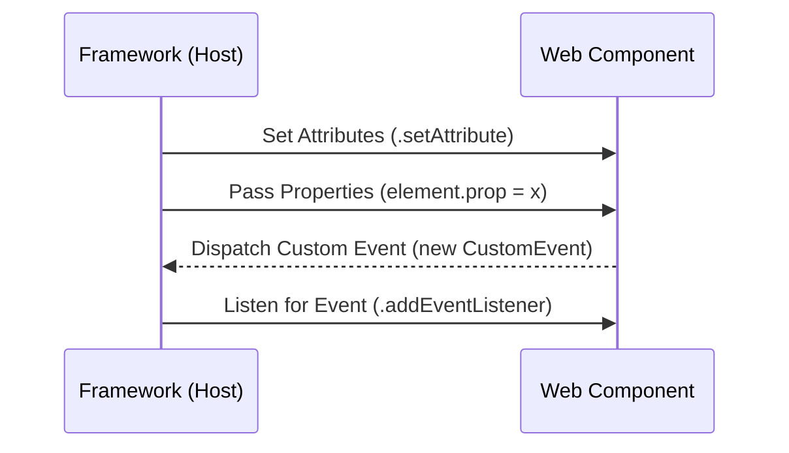

import Tabs from '@theme/Tabs';
import TabItem from '@theme/TabItem';

# Web Components Interoperability

**Web Components** are designed to be framework-agnostic. However, because each framework (React, Vue, Angular) has its own way of handling data and events, achieving smooth **Interoperability** requires specific design patterns.

:::info[Core Philosophy]
**Standard as the Bridge**. The goal is to use the native browser APIs (DOM attributes and Custom Events) as the common language that allows a component built in 2024 to work in a framework build in 2034.
:::

---

## 1. Easy: Using "Foreign" Tags

Browser-native Custom Elements can be used directly in any HTML-based framework. 

- **In Vue/Angular**: These frameworks use standard HTML attributes, so Web Components "just work" out of the box.
- **In React**: React has a custom event system that historically struggled with Custom Elements, but React 19+ has significantly improved native integration.



---

## 2. Medium: Attributes vs. Properties

Data flow in interoperability follows the **"Props Down, Events Up"** pattern:

1.  **Lowering Data (Attributes)**: Use strings for small, simple data.
2.  **Lowering Data (Properties)**: Use for complex data like Objects or Arrays. Frameworks must access the DOM node directly to set these.
3.  **Raising Data (Events)**: Custom elements should never call framework functions directly; they should `dispatchEvent`.

---

## 3. Hard: The React Compatibility Layer

React (pre-v19) treats all props as attributes. This means if you pass an object to a Web Component in React, it gets stringified to `"[object Object]"`.

<Tabs groupId="lang" queryString>
<TabItem value="js" label="JavaScript">

```javascript
// A Web Component with an object property
class UserCard extends HTMLElement {
  set data(val) {
    this._data = val;
    this.render();
  }
  render() {
    this.innerHTML = `<div>${this._data.name}</div>`;
  }
}
customElements.define('user-card', UserCard);

// React consumption (Manual Sync)
function ReactApp() {
  const wcRef = useRef(null);

  useEffect(() => {
    // Manually setting the property on the object
    if (wcRef.current) {
      wcRef.current.data = { name: 'Prakhar' };
    }
  }, []);

  return <user-card ref={wcRef}></user-card>;
}
```

</TabItem>
<TabItem value="ts" label="TypeScript">

```typescript
// Declaring the custom element for TSX
declare global {
  namespace JSX {
    interface IntrinsicElements {
      "user-profile": any;
    }
  }
}

const UserProfile = () => {
  const profileRef = useRef<HTMLElement>(null);

  useEffect(() => {
    const handleUpdate = (e: Event) => {
      console.log("Updated!", (e as CustomEvent).detail);
    };

    const node = profileRef.current;
    if (node) {
      // Manual event listener for Custom Elements in React
      node.addEventListener("user-update", handleUpdate);
      return () => node.removeEventListener("user-update", handleUpdate);
    }
  }, []);

  return <user-profile ref={profileRef} />;
};
```

</TabItem>
</Tabs>

---

## 4. Advanced: Declarative Shadow DOM (DSD) and SSR

The biggest challenge with Web Components is **Server-Side Rendering (SSR)**. Since Shadow DOM usually requires JavaScript to attach, the component remains an "empty shell" until the JS loads on the client.

**Declarative Shadow DOM** allows you to define the shadow tree directly in HTML using the `<template shadowrootmode="open">` tag. This allows the browser to render the component **before any JavaScript executes**, solving the FOUC (Flash of Unstyled Content) problem.

---

## 5. Interview Prep: 4 Key Questions

### Q1: Why does React need special handling for Web Components?
**A:** Historically, React used a "Synthetic Event" system and assumed that any prop passed to an element should be treated as an HTML attribute. Since Web Components often expect complex data via Properties, React users had to use `useRef` to manually set properties on the underlying DOM node. React 19 solves most of these issues by checking for properties first.

### Q2: How do you pass a callback function to a Web Component?
**A:** You shouldn't. Passing functions as props is a framework-specific pattern (like React's `onClick`). For true interoperability, the Web Component should dispatch a **CustomEvent** (e.g., `this.dispatchEvent(new CustomEvent('click-event'))`), and the framework should listen for that event using standard DOM listeners.

### Q3: What is "Flash of Unstyled Content" (FOUC) in Web Components?
**A:** It occurs when the browser renders the custom tag (e.g., `<my-card>`) before the JavaScript definition has loaded. For a brief moment, the user sees unstyled content or nothing at all. This is solved by using the `:defined` CSS pseudo-class to hide components until they are upgraded, or by using Declarative Shadow DOM.

### Q4: Explain the importance of `bubbles` and `composed` in Custom Events.
**A:** When dispatching a `CustomEvent` from within a Shadow DOM:
- `bubbles: true`: Allows the event to travel up the DOM tree inside the shadow root.
- `composed: true`: Allows the event to **cross the shadow boundary** and bubble up into the Light DOM, where frameworks or other scripts can see it. Without `composed: true`, the event is trapped inside the component.
