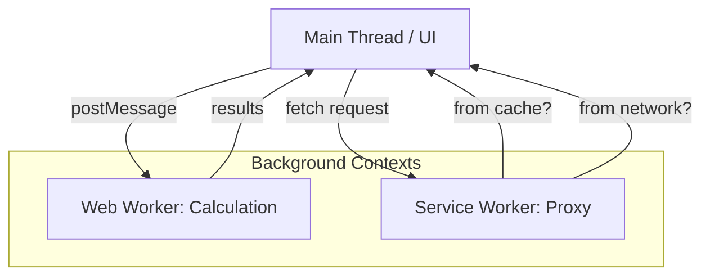

import Tabs from '@theme/Tabs';
import TabItem from '@theme/TabItem';

# Web Workers vs. Service Workers

While both **Web Workers** and **Service Workers** run in background threads and don't block the UI, they serve fundamentally different purposes and have different lifecycles.

:::info[Core Philosophy]
**Computational vs. Proxy**. Web Workers are for offloading heavy **logic** (like math or image processing). Service Workers are for intercepting **network requests** (like caching for offline apps).
:::

---

## 1. Easy: What is a Worker?

The "Main Thread" is like a single-lane bridge. If one big truck (a heavy task) stops on the bridge, nobody else can cross. 
- **Web Workers**: Add a **second bridge** next to the first one. You can move the truck there so the main bridge stays clear for cars (the UI).
- **Service Workers**: Add a **toll booth/cache** at the entrance of the bridge. It can decide to give you a car from the garage (cache) instead of making you wait for one to come from across the river (the network).



---

## 2. Medium: Lifecycle and Scope

| Feature | Web Worker | Service Worker |
| :--- | :--- | :--- |
| **Primary Use** | High-performance calculations. | PWA features, offline support, push notifications. |
| **Lifecycle** | Tied to the tab. If you close the tab, the worker dies. | Independent of the tab. Can stay alive even after the site is closed. |
| **DOM Access** | None. | None. |
| **Interception** | Cannot see network requests. | Can intercept every `fetch()` request from the site. |

---

## 3. Hard: Implementation and Communication

Both use `postMessage` for communication, but Service Workers require a separate registration step.

<Tabs groupId="lang" queryString>
<TabItem value="js" label="JavaScript">

```javascript
// Registering a Web Worker
const webWorker = new Worker('worker.js');
webWorker.postMessage('Start calculation');

// Registering a Service Worker
if ('serviceWorker' in navigator) {
  navigator.serviceWorker.register('/sw.js').then(reg => {
    console.log('SW Registered!');
  });
}

// Inside sw.js (Intercepting requests)
self.addEventListener('fetch', (event) => {
  event.respondWith(
    caches.match(event.request).then(response => {
      return response || fetch(event.request);
    })
  );
});
```

</TabItem>
<TabItem value="ts" label="TypeScript">

```typescript
// Web Worker Implementation
const worker: Worker = new Worker(new URL("./worker.ts", import.meta.url));
worker.onmessage = (e: MessageEvent<string>) => console.log(e.data);

// Service Worker (worker.ts context)
/// <reference lib="webworker" />

const sw = self as unknown as ServiceWorkerGlobalScope;

sw.addEventListener("install", (event) => {
  console.log("Service Worker installed");
});

sw.addEventListener("activate", (event) => {
  console.log("Service Worker activated and ready");
});
```

</TabItem>
</Tabs>

---

## 4. Advanced: Shared Workers and Channel Messaging

There is a third type: **Shared Worker**. 
Unlike a standard Web Worker (which is 1-to-1 with a tab), a Shared Worker can be accessed by multiple tabs from the same origin. 

**MessageChannel API**: You can use a `MessageChannel` to establish a direct connection between a Web Worker and a Service Worker, or between two different tabs, allowing them to communicate without ever touching the Main Thread.

---

## 5. Interview Prep: 4 Key Questions

### Q1: When would you use a Web Worker instead of a Service Worker?
**A:** Use a Web Worker when you have a specific, heavy CPU task (like parsing a 50MB JSON file or running a physics engine) that only needs to happen while the user is on the current page. Use a Service Worker when you need background sync, push notifications, or offline functionality that exists independently of a single tab.

### Q2: Can a Service Worker access the `localStorage` API?
**A:** No. Service Workers are designed to be fully asynchronous. `localStorage` is a synchronous API. Instead, Service Workers must use **IndexedDB** or the **Cache API** for persistent storage.

### Q3: Explain the "Update Lifecycle" of a Service Worker.
**A:** When a browser finds a new version of the SW script: 1. It installs the new version (`install` event). 2. It stays in a "waiting" state while the old SW is still controlling open tabs. 3. Once all tabs are closed or `skipWaiting()` is called, the new SW takes over (`activate` event).

### Q4: How do you handle UI updates from a Web Worker?
**A:** Since workers cannot touch the DOM, they must `postMessage` the result of their work back to the Main Thread. The Main Thread then receives a `message` event and uses that data to update the DOM elements using standard React/JS methods.
